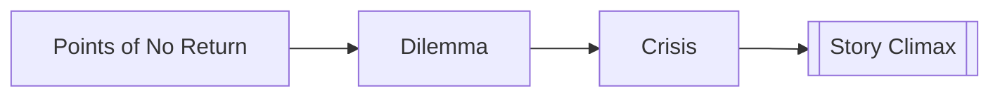

# Crisis

> 中文版：[[wiki/zh/concepts/crisis|中文]]

## Definition
**Crisis** is the ultimate decision of the story: the protagonist's last choice under maximum pressure before the final action.

## McKee's Argument
McKee identifies crisis as the true [[obligatory-scene]]. Progressive complications have exhausted all lesser actions, so only one meaningful action remains. The audience leans forward because the answer to the story's major question will emerge from this choice.

## How It Works

The crisis is often deliberately static: a pause in which pressure compresses. Once the protagonist chooses, that stored tension detonates into climax.

## Film Examples
- **[[star-wars]]** — Luke must choose machine certainty or trust in the Force.
- **[[thelma-louise]]** — The women hold the moment of decision before driving into the void.
- **[[kramer-vs-kramer]]** — Ted refuses to make his son choose in court.

## Relationship to Other Concepts
- [[obligatory-scene]] — McKee ultimately identifies the two.
- [[dilemma]] — The form crisis should take.
- [[story-climax]] — The climactic action explodes out of the crisis decision.
- [[points-of-no-return]] — Crisis is the final and deepest of them.

## Common Mistakes
Writers skim past the decision and rush to action, or they reduce crisis to an obvious right-versus-wrong choice.

## Sources
- *Story* Chapter 13

