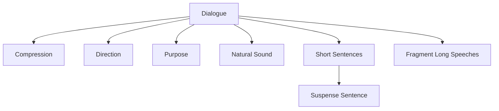

# Dialogue

> 中文版：[[wiki/zh/concepts/dialogue|中文]]

## Definition
**Dialogue** is screen speech — not transcribed conversation. McKee defines it as speech that sounds like everyday talk but operates with compression, direction, and purpose; every line either turns a beat or builds toward the scene's [[turning-point]].

## McKee's Argument
Real conversation "keeps the channel open" — it rarely makes a point or achieves closure. If you put that on screen, the audience dies. Screen dialogue:

- **Compresses.** Says the maximum in the fewest possible words.
- **Directs.** Each exchange shifts the beat in one direction or another; no repetition.
- **Purposes.** Each line executes a step that arcs to the scene's turn.
- **Sounds natural.** Contractions, fragments, slang, profanity as needed.
- **Breathes short.** Short, simply constructed sentences — noun to verb to object.
- **Prefers the [[suspense-sentence]].** Meaning delayed until the last word, forcing both actor and audience to listen to the end.
- **Fragments long speeches.** Action/reaction beats fracture any "monologue"; a character can react to himself.

Film is 80% visual. Dialogue is the *last* layer added to a screenplay; image outranks speech. See [[silent-screenplay]].

## How It Works
- **Aristotle's rule:** "Speak as common people do, but think as wise men do."
- **Read aloud.** Avoid tongue twisters and accidental rhymes; the page is for the actor.
- **Cut the lines that preen.** Anything that shouts "clever line am I" — cut it.
- **Break every long speech.** Insert silent reactions or parentheticals so the speaker changes beat.
- **Leave room for the actor.** Fifty percent of dialogue meaning arrives via face and gesture; off-camera voice flattens the listener's subtext.
- **Route exposition through ammunition.** See [[exposition-as-ammunition]].

## Film Examples
- *Amadeus* — Salieri's confession to the priest, broken by silent reactions and parentheticals (priest looks away, amused, angered at Mozart…).
- *Casablanca* — Rick and Ilsa's double-entendre scene: surface speech, subtext life.
- *The Silence* — A waiter-seduction without a line of dialogue; the model counter-example.

## Relationship to Other Concepts
- Contains [[text-and-subtext]]: surface is the text; life is the subtext.
- Subordinate to [[description]] and image — see [[silent-screenplay]].
- Carries [[exposition-as-ammunition]].
- Shaped syntactically by the [[suspense-sentence]].

## Common Mistakes
- Writing conversation instead of dialogue.
- Literary prose that jumps off the page.
- Monologues that forget action/reaction.
- Tongue-twisters, accidental rhymes, empty prepositional tails.
- Putting exposition in a line both characters already know.
- Writing dialogue before subtext is in place (see [[chapter-19-a-writers-method]]).

## Sources
- *Story* Chapter 18
