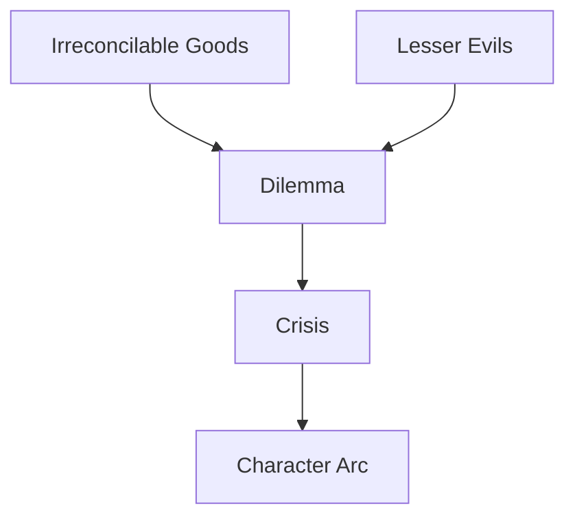

# Dilemma

> 中文版：[[wiki/zh/concepts/dilemma|中文]]

## Definition
A **Dilemma** is a true dramatic choice: either between irreconcilable goods or between the lesser of two evils.

## McKee's Argument
Good versus evil is not a dramatic choice because from the character's point of view one option is already "right." The revealing choice happens when both options cost something precious. That is why crisis exposes deep character better than any speech.

## How It Works

## Film Examples
- **[[thelma-louise]]** — Prison or death: neither acceptable, one unavoidable.
- **[[ordinary-people]]** — Calvin's family love is split against family truth.
- **[[the-empire-strikes-back]]** — Luke repeatedly faces choices no outcome leaves clean.

## Relationship to Other Concepts
- [[crisis]] — Crisis is the dramatic home of dilemma.
- [[protagonist]] — The protagonist is defined by the quality of this choice.
- [[character-arc]] — Arc culminates in what the character chooses under deepest pressure.
- [[story-climax]] — The chosen action becomes the climax.

## Common Mistakes
Vacillation is not dilemma. If a story merely rocks between yes and no, it risks repetition without closure.

## Sources
- *Story* Chapter 13

