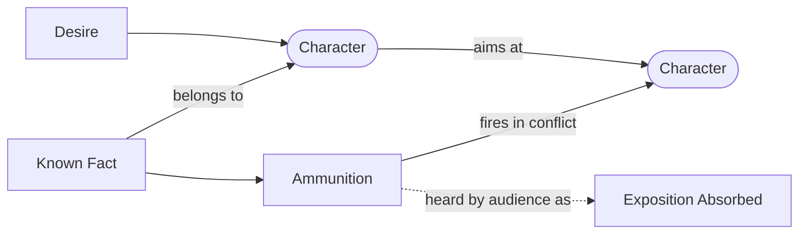

# Exposition as Ammunition

> 中文版：[[wiki/zh/concepts/exposition-as-ammunition|中文]]

## Definition
**Exposition as ammunition** is McKee's mnemonic rule for handling exposition: your characters know their world, their history, each other, and themselves — let them *use* what they know as weapons in their struggle to get what they want. The audience receives facts as byproducts of combat.

## McKee's Argument
The novice believes exposition is an obligation to the audience that must be "gotten out of the way." So he writes Jack asking Harry, "How long have we known one another? Twenty years, since college?" — information neither character needs. The master inverts the frame: if Jack needs Harry to change his ways, Jack throws the past at him: "Same hippie haircut, still stoned by noon, the same stunts that got you kicked out twenty years ago." The audience learns the facts while watching the fight.

## How It Works
- **Give each character a full dossier.** Biography, grudges, secrets, expertise. Then *let them use it.*
- **Put need under the line.** If a character has no reason to weaponize this fact at this moment, the moment is wrong.
- **Stage conflict first, fact second.** Design the dramatic need, then thread the expositional payload through it.
- **Prefer subtext.** The sharpest ammunition often lands as implication; the audience's eye jumps to a reaction shot and hears a past date or relationship in passing.
- **Under [[law-of-conflict]].** Since every scene must turn on conflict, every fact can be carried by that conflict.

## Film Examples
- **[[casablanca]]** — Rick and Ilsa's Paris history enters via drunken confrontation, jealousy, and double entendres. Facts arrive embedded in attacks.
- **[[chinatown]]** — Cross and Gittes trade pasts as threats. Their expositional shots always carry motive.
- *A Few Good Men* — The climactic "You can't handle the truth" is exposition used as a weapon, not a speech.

## Relationship to Other Concepts
- The operational form of [[dramatize-dont-explain]] applied to [[exposition]].
- Shaped by the [[law-of-conflict]] — conflict is the carrier; fact is the cargo.
- Often routes information through [[text-and-subtext]]: surface speech does one thing; exposition rides underneath.

## Common Mistakes
- Making characters say things they both already know.
- Loading ammunition with generic background ("as you know, I'm your brother") rather than charged, needle-sharp facts.
- Revealing too much at once — ammunition spent in one burst leaves no rounds for later turning points.

## Sources
- *Story* Chapter 15
