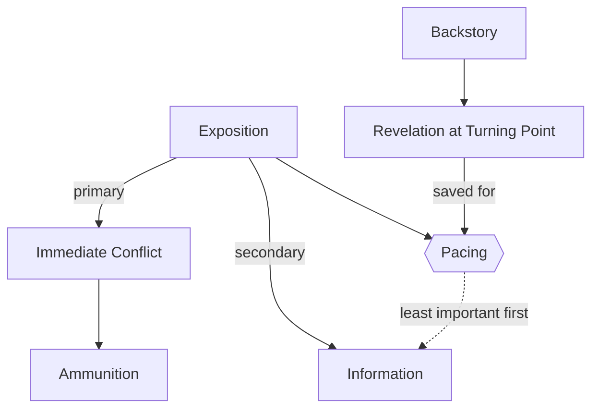

# Exposition

> 中文版：[[wiki/zh/concepts/exposition|中文]]

## Definition
**Exposition** is the information about setting, biography, and characterization that the audience needs to follow and comprehend the events of the story. Mastered well, exposition is *invisible*: facts slip into the audience unconsciously, as a byproduct of conflict.

## McKee's Argument
Dealing with exposition is the single clearest gauge of a writer's craft. The novice writes scenes that exist only to lay out facts; the master writes scenes that pursue desire and carry facts as ammunition. Exposition has two jobs, and their order matters: **primary purpose is to further the immediate conflict; secondary purpose is to convey information.** Novices reverse these and produce "California scenes" (instant confessions between strangers) or "table dusting" (servants informing each other of what both already know).

The audience's interest is held not by *giving* information but by *withholding* it, releasing only what is absolutely needed for comprehension and creating the *desire to know* by arousing curiosity.

## How It Works
- **Dramatize, don't explain.** Every fact passes via characters doing something that matters to them right now.
- **Convert to ammunition.** Let characters use what they know to get what they want. The listener receives facts in the line of fire.
- **Pace it.** Least important facts early, critical facts late, deepest secrets — from the [[backstory]] — at the Act Climaxes.
- **Create the need to know.** Rather than dumping information, put a "Why?" in the audience's mind, then pay off.
- **Skip what is assumable.** Never include anything the audience can reasonably and easily assume has happened.
- **Pick your vehicle.** [[flashback|Flashbacks]], dream sequences, montages, and voice-overs are all forms of exposition; each must dramatize (or add counterpoint), not decorate.

## Film Examples
- **[[chinatown]]** — "She's my sister and my daughter" is exposition saved until its revelation detonates the Act Two Climax.
- **[[the-empire-strikes-back]]** — "I am your father" is backstory exposition pushed to the maximum possible Turning Point.
- **[[casablanca]]** — Exposition about Rick's past enters through quarrel, jealousy, and double entendre — never as a speech.
- *Reservoir Dogs* — The botched heist is withheld, then flashed back to whenever the warehouse tension dips.

## Relationship to Other Concepts
- Operational form of [[exposition-as-ammunition]].
- Drawn from the [[backstory]] and often delivered through a [[flashback]].
- Pays off as [[setup-and-payoff]] and as the revelation half of a [[turning-point]].
- Lives partly in [[text-and-subtext]] — what is *not* said often exposes more than what is said.

## Common Mistakes
- **Table dusting**: characters telling each other what both already know.
- **California scenes**: strangers confessing deep secrets after one coffee.
- **Front-loading**: dumping exposition in Act One to "get it out of the way."
- **On-the-nose flashback or voice-over**: illustrating what is already clear or replacing drama with narration.
- **Cliff-hanger tease**: promising an exciting future scene to cover a boring thirty-minute detour.

## Sources
- *Story* Chapter 15
- *Story* Chapter 8 (initial introduction within [[backstory]])
