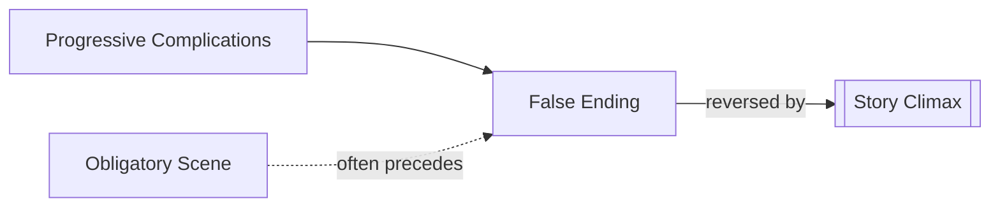

# False Ending

> 中文版：[[wiki/zh/concepts/false-ending|中文]]

## Definition
A **False Ending** is a scene, usually late in Act Three, so complete in its apparent closure that the audience briefly believes the story is over — before a final reversal reveals the true climax.

## McKee's Argument
The false ending is a sophisticated device most at home in Long Form (two-hour-plus films) and genres where the audience has been primed for a triumph or defeat. It releases tension prematurely so the true climax can strike with renewed force. Misused, it feels like a cheat; placed with craft, it doubles the emotional payoff.

## Film Examples
- *Aliens* — Ripley seemingly escapes; the Queen then emerges from the landing gear.
- *The Silence of the Lambs* — Crawford's team raids the wrong house; Clarice is the one at Buffalo Bill's door.

## Relationship to Other Concepts
- [[story-climax]] — The false ending exists to sharpen the real climax.
- [[obligatory-scene]] — A false ending may masquerade as the obligatory scene.
- [[progressive-complications]] — The false ending is the last, deepest complication.

## Common Mistakes
- Using a false ending when the story has not earned the misdirection.
- Letting the false ending deflate the audience instead of priming them.

## Sources
- *Story* Chapter 9
