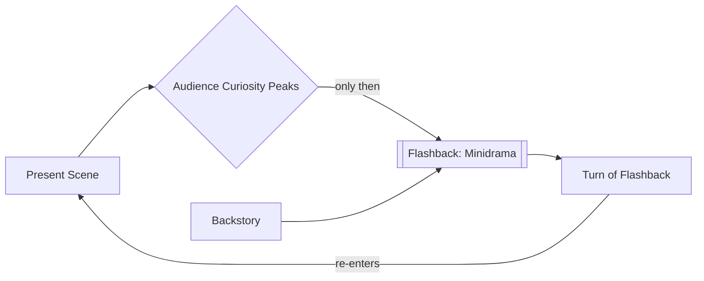

# Flashback

> 中文版：[[wiki/zh/concepts/flashback|中文]]

## Definition
A **flashback** is a dramatized excursion into the past used to reveal [[exposition]]. Done well, a flashback is a *minidrama* with its own inciting incident, progressions, and turning point — and it *accelerates* pace rather than slowing it.

## McKee's Argument
Flashback is a form of exposition and obeys every rule of exposition: dramatize, pace, withhold, pay off. Producers often say flashbacks drag; badly done they do. But a flashback that arrives only after the audience is *hungry* for it, and that turns internally like any other scene, reads as forward motion. "Do not bring in a flashback until you have created in the audience the need and desire to know."

## How It Works
- **Dramatize.** Give the flashback its own inciting incident, progression, and turn — not a slideshow.
- **Gate the entry.** Open the flashback only after the present story has planted a pressing question.
- **Put it to work.** The flashback should change the audience's understanding of the present scene when we return.
- **Choose the kind.**
  - *Casablanca form*: the flashback arrives at an Act turn and accelerates the film.
  - *Agatha Christie / Reservoir Dogs form*: open with the discovery of the crime or the getaway, then flash back to what is missing; curiosity runs in both directions.
- **Stay filmic.** Flashbacks are not novelistic free association; the camera is an X-ray for anything contrived.

## Film Examples
- **[[casablanca]]** — Paris flashback at the top of Act Two, delayed until the audience is burning to know what happened.
- *Reservoir Dogs* — The botched heist (first half of the inciting incident) is withheld and flashed back to whenever the warehouse scene needs energy.
- *Sunset Boulevard* — The whole film is a feature-length flashback under dramatic irony: we already know Gillis ends up dead.
- *Betrayal* (Pinter) — A love story told in reverse: every "flashback" is chronologically earlier than the last.

## Relationship to Other Concepts
- A vehicle for [[exposition]] drawn from the [[backstory]].
- Typically timed with [[turning-point|turning points]] and act climaxes.
- Modulates [[pacing]] — a proper flashback accelerates; a lazy one stalls.
- Can construct a long-arc [[setup-and-payoff]] across large spans of time.

## Common Mistakes
- Flat flashbacks — informational montage without its own drama.
- Entering before curiosity is established — the audience reads it as a detour.
- Using flashback to dramatize what could be heard in a line.
- Flashback-as-novel: stream-of-consciousness images meant to evoke a character's private memory; the camera flattens them.

## Sources
- *Story* Chapter 15
