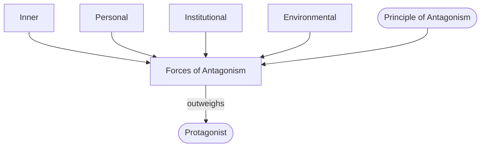

# Forces of Antagonism

> 中文版：[[wiki/zh/concepts/forces-of-antagonism|中文]]

## Definition
The **forces of antagonism** are the *sum total* of all forces that oppose the [[protagonist]]'s will and desire. They are not the same as an antagonist or villain; they include inner flaws, personal conflicts with other characters, institutional pressures, and environmental or cosmic hostility.

## McKee's Argument
"Forces of antagonism" does not necessarily refer to a specific antagonist. In appropriate genres arch-villains are a delight, but the writer's target is the *totality* of opposition. Weighed against the protagonist's willpower and capacities at the [[inciting-incident]], the total should outweigh him — giving him a chance, but no favored odds. This inequality is what compels the protagonist into ever truer choices and so into a multidimensional character.

## How It Works
- **Inventory across levels.** Catalog antagonism at every [[levels-of-conflict|level of conflict]]: inner (inside the protagonist), personal (intimate relationships), extra-personal (institutions, society, environment).
- **Aggregate, don't localize.** The power is in the *sum*. A strong villain with nothing else behind him cannot match a weaker villain backed by institutional and inner forces.
- **Push down the declension.** Antagonism progresses by moving the story through the [[value-progression]] — Contrary, Contradictory, [[negation-of-the-negation|Negation of the Negation]] — not by piling on homogeneous setbacks.
- **Design early.** Build the negative side first; the positive side will be forced to rise in response.

## Film Examples
- **[[chinatown]]** — Noah Cross is a single human antagonist, but the forces include the department's corruption, Los Angeles's water politics, Evelyn's family secret, and Jake's own guilt from his Chinatown past. The protagonist has no layer that is safe.
- **[[casablanca]]** — Nazi occupation (institutional), Ilsa's loyalty to Laszlo (personal), Rick's self-hatred (inner), a neutral city that is a trap (environmental): four orchestrated fronts.
- **[[the-terminator]]** — The antagonist is a near-perfect killing machine, but the forces also include the LAPD that disbelieves Sarah, the future war, and Sarah's own fear and inexperience.

## Relationship to Other Concepts
- Governed by the [[principle-of-antagonism]].
- Structured by the [[value-progression]] and measured at its extreme by the [[negation-of-the-negation]].
- Distributed across the [[levels-of-conflict]].
- Supplies the resistance that the [[law-of-conflict]] requires in every scene.

## Common Mistakes
- Equating "forces of antagonism" with a single villain.
- Overloading one level (a towering villain, but no institutional or inner dimension) while neglecting the others.
- Adding more of the same kind of pressure instead of descending the declension.
- Building the hero first and hoping an opposing force will "emerge."

## Sources
- *Story* Chapter 14 (core definition)
- *Story* Chapter 7 ([[levels-of-conflict]])
- *Story* Chapter 9 (operational role in [[progressive-complications]])
