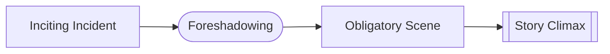

# Foreshadowing

> 中文版：[[wiki/zh/concepts/foreshadowing|中文]]

## Definition
**Foreshadowing** is the arrangement of early events to prepare for later events. Its primary component is the projection of the [[obligatory-scene]] into the audience's imagination by the [[inciting-incident]], but Chapter 10 widens it into the broader architecture of [[setup-and-payoff]].

## McKee's Argument
Every choice — genre, setting, character, mood, line, gesture, object — foreshadows. The writer layers in material that may first seem to mean one thing and later reveal a deeper meaning when the turn arrives.

## Film Examples
- *Jaws* — Every subsequent shark sighting foreshadows the sheriff/shark showdown.
- *Tender Mercies* — Small hints of Sledge's fragility foreshadow the daughter's death.

## Relationship to Other Concepts
- [[inciting-incident]] — The primary foreshadowing act.
- [[obligatory-scene]] — What foreshadowing points toward.
- [[setup-and-payoff]] — The larger architecture of preparation and delivery.

## Common Mistakes
- Telegraphing (too explicit) vs. no preparation at all.
- Foreshadowing what never pays off — an unearned promise.

## Sources
- *Story* Chapters 8 and 10
