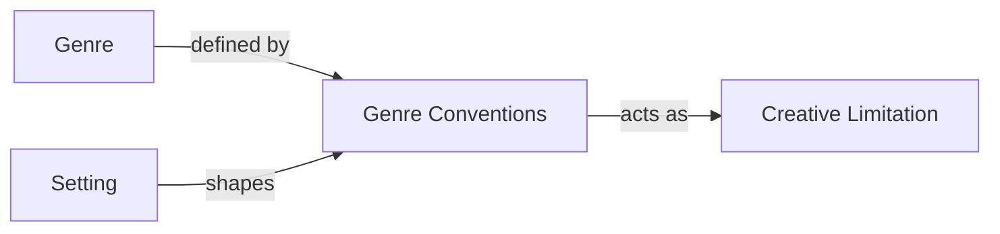

# Genre Conventions

> 中文版：[[wiki/zh/concepts/genre-conventions|中文]]

## Definition

Genre conventions are the specific settings, roles, events, and values that define individual genres and their subgenres. They are the audience's expectations — the structural patterns that filmgoers have internalized through a lifetime of moviegoing.

## Concept Map

## McKee's Argument

Conventions are not clichés — they are necessary elements of form. That boy meets girl in a Love Story is a convention; the cliché is *how* they meet (the tired singles-bar encounter, the adventure-forced hate-at-first-sight). The writer's challenge is to fulfill the convention in a way that is fresh and original.

Some genres have relatively simple, pliable conventions (the Disillusionment Plot requires only an optimistic protagonist progressively disillusioned). Others are rigid and complex (the Crime Genre demands a crime, a detective, clues, suspects, and apprehension). Comedy has one overriding convention that unites all its subgenres: "Nobody gets hurt."

Genre conventions function as [[creative-limitation|creative limitations]] — the "rhyme scheme" of the storyteller's poem. They don't inhibit creativity; they inspire it by forcing the writer to solve known problems in unknown ways.

## How It Works

1. **Identify your genre's conventions** — What settings, roles, events, and values does the audience expect?
2. **Fulfill every convention** — Omitting a convention confuses or disappoints the audience.
3. **Find fresh execution** — The convention is non-negotiable; *how* you fulfill it is where originality lives.
4. **Study successes and failures** — Break down films in your genre by setting, role, event, and value to discover what the genre always does.

## Film Examples

- **A Fish Called Wanda** — The Comedy convention "nobody gets hurt" demonstrated and tested: the gory squashed-terrier version killed the laugh; the sanitized version got it.
- **[[chinatown]]** — Broke the Murder Mystery convention that the detective punishes the criminal. This was only possible in the 1970s when America's disillusionment was deep enough to accept it.
- **Die Hard** — Fresh execution of the Action convention "hero at mercy of villain": gun duct-taped to a naked back.

## Relationship to Other Concepts

- [[genre]] — Conventions are the building blocks that define each genre
- [[creative-limitation]] — Conventions function as creative constraints that inspire originality
- [[setting]] — Conventions further limit the possibilities already constrained by setting

## Common Mistakes

- Confusing convention with cliché — convention is *what* must happen; cliché is *how* it's been done before
- Omitting conventions, thinking it makes the story more original — it makes it confusing
- Ignoring how conventions evolve with society — what worked in the 1950s may bore a modern audience
- Knowing conventions only from watching films, not from rigorous systematic study

## Sources

- *Story* Chapter 4, "The Relationship Between Structure and Genre"
