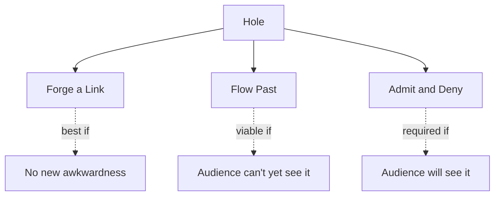

# Hole (Logic Gap)

> 中文版：[[wiki/zh/concepts/hole|中文]]

## Definition
A **hole** is a missing link in a story's chain of cause and effect — a jump in logic. Holes are a fact of life and appear in films of all levels. The question is not how to eliminate them entirely, but how to handle the ones that survive.

## McKee's Argument
A story on the page sits still and reveals its holes; on screen the story flows and the audience may not have the time or information to spot them. Three strategies, in order of preference:

1. **Forge the chain.** Write a scene that closes the hole — if it can be done without creating a new awkwardness.
2. **Rely on flow.** If by the time the gap arrives the audience lacks the information to notice, let it pass.
3. **Admit and deny.** Put the hole in the protagonist's mouth and let them shrug it off. The audience nods and moves on.

## How It Works
- **Test against flow.** A hole you can see at your desk may be invisible in motion. Watch the film, don't read the script, when deciding.
- **Admit by voicing.** [[casablanca|*Casablanca*]]: Ferrari helps Laszlo with no profit, then says "Why I'm doing this I don't know because it can't possibly profit me…" The audience nods and accepts.
- **Wall the hole with confusion.** [[the-terminator|*The Terminator*]] admits its causal abyss through Sarah's own voice at the end: "You could go crazy thinking about this." The audience accepts and moves on.
- **Never plug holes with [[coincidence]].** A convenient accident is not a fix; it is a second hole.

## Film Examples
- **[[casablanca]]** — Ferrari's out-of-character generosity is named and forgiven.
- **[[the-terminator]]** — The time-loop paradox is spoken aloud and dismissed.
- *Chinatown* — Ida Sessions knows things she shouldn't; the audience forgets before they can question.

## Relationship to Other Concepts
- A threat to [[authenticity]]; how the hole is handled can preserve or destroy the audience's willing suspension of disbelief.
- Distinct from [[coincidence]]; a coincidence is a random event, a hole is a missing link. Using coincidence to patch a hole compounds the problem.
- Often pre-empted by [[foreshadowing]] that gives the later gap a handhold.

## Common Mistakes
- Kicking sand over the hole and hoping no one notices.
- Patching with a new scene that creates a worse awkwardness.
- Patching with a coincidence.
- Ignoring the difference between page and screen — the same hole reads very differently in each.

## Sources
- *Story* Chapter 16
