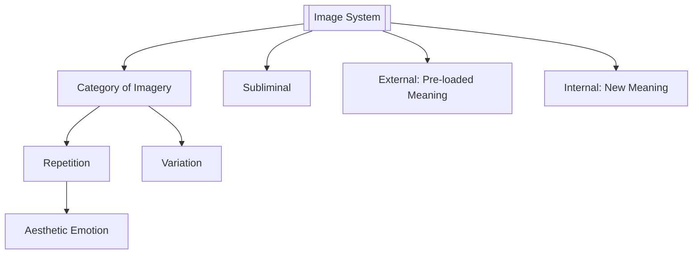

# Image Systems

> 中文版：[[wiki/zh/concepts/image-systems|中文]]

## Definition
An **Image System** is a strategy of motifs — a category of imagery embedded in the film that repeats in sight and sound from beginning to end with persistence and great variation, but with equally great subtlety, as a **subliminal** communication that deepens the complexity and emotion of the work.

## McKee's Argument
The audience reads every onscreen image symbolically — a car becomes "rich," "dangerous," "artist," just by make and model. The storyteller can build on this by narrowing the film's imagery to a category with the right connotations and then repeating that category with variation.

Two kinds:

- **External Imagery** — A category with meaning already assigned outside the film (a flag = patriotism, a crucifix = religion, a spider's web = entrapment) brought in to mean the same thing. The hallmark of the student film.
- **Internal Imagery** — A category brought into the film to carry a new meaning appropriate to *this* film alone. *Les Diaboliques* inverts water's universal positive valence into death and terror. *Chinatown* turns images of "blind seeing" — windows, mirrors, broken eyeglasses, binoculars, cameras — into the theme that evil lies within us.

Most important: an Image System **must be subliminal.** If the audience recognizes a symbol as a symbol, it turns neutral, powerless. Symbolism works as music or dream imagery works — only when it bypasses the conscious mind.

## How It Works
- **Exclude 90% of reality.** Narrow the palette to objects whose connotations fit this film.
- **Pick a broad enough category.** Nature dimensions (seasons, animals, light/dark), culture dimensions (buildings, machines, art), bodily motifs (water, rope, eyes).
- **Repeat with variation.** Isolated symbols die; a dozen variations within one category compound.
- **Prefer Internal over External.** Invent new meaning inside the film; don't import stock meaning.
- **Stay subliminal.** When the audience chants "symbol!" the system is dead (McKee's *Viridiana* anecdote).
- **Writer begins, designer finishes.** The writer seeds the system in description and dialogue; the director and designers extend it in production.

## Film Examples
- **[[casablanca]]** — Three systems: imprisonment (beacon, shadows like bars, "escape" plans); America-as-the-world (cosmopolitan refugees, Rick spoken to as a country); linked/separated (Rick and Ilsa linked by framing; Ilsa and Laszlo separated by composition).
- **[[chinatown]]** — Four systems: blind seeing (windows, mirrors, cameras, broken glasses, unseeing eyes of the dead), corrupt contract (subverted laws as social glue), water/drought, sexual cruelty/love.
- *Les Diaboliques* — Water as inverted death symbol; the film is "one of the dampest films ever made."
- *Aliens* — Motherhood system (Ripley as surrogate mother; queen alien as monstrous mother; Newt's broken doll) reinvented from the erotic/"rape" system of *Alien*.
- *After Hours* — Art as weapon.
- *Through a Glass Darkly* — Four systems in point/counterpoint.

## Relationship to Other Concepts
- Interacts with [[setting]] — the world's physical and social dimensions are where imagery lives.
- Carries unacknowledged payload of the [[controlling-idea]]; what argument can't say, poetics whispers.
- Produces [[aesthetic-emotion]] in depth by engaging the unconscious.
- Often rides the arc of [[symbolic-ascension]] from literal to archetypal.
- First seeded in [[description]].

## Common Mistakes
- **Labeling symbols.** Characters name them; camera lingers; the system dies.
- **Too few repetitions.** One or two placements do nothing.
- **External imagery as shortcut.** Flags, crosses, webs — instant student film.
- **Pretty pictures mistaken for poetry.** Decorative photography is not an image system.
- **Pure director burden.** Writers who say "that's the director's job" leave imagery to chance; the writer should begin it.

## Sources
- *Story* Chapter 18
