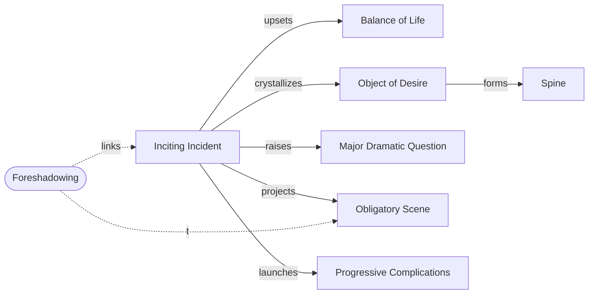

# Inciting Incident

> 中文版：[[wiki/zh/concepts/inciting-incident|中文]]

## Definition
The **Inciting Incident** is the first major event of the telling. It **radically upsets the balance of forces in the protagonist's life**, arouses in him the desire to restore balance, causes him to conceive an [[object-of-desire]], and propels him into active pursuit of it.

## McKee's Argument
Every story is a Quest, and the Inciting Incident is the starter of that quest. It cannot be vague, static, or diffused: it must swing the protagonist's life decisively to the positive or the negative. It may occur randomly (coincidence) or causally (decision — by the protagonist or by someone with power over his life), but there are no other means. Occasionally it is a setup-and-payoff pair of events, but the payoff cannot be delayed. The Central Plot's Inciting Incident must occur **onscreen**: it is the film's "big hook," the event that raises the [[major-dramatic-question]] and projects the [[obligatory-scene]] into the audience's imagination.

## How It Works
- Location: typically within the first 25% of the telling — as soon as possible, but not before the audience can fully react.
- Quality: whatever is germane to the world; can be as small as a look, as loud as an explosion.
- Function checklist: Does it radically upset the balance? Arouse desire? Crystallize an object of desire? Raise the Major Dramatic Question? Project the Obligatory Scene?
- Complex protagonist: it may arouse an unconscious desire that contradicts the conscious one, establishing the [[spine]].

## Film Examples
- **[[kramer-vs-kramer]]** — Mrs. Kramer walks out on husband and child (minute 2). Archetypal; requires no setup.
- **[[jaws]]** — Shark eats swimmer (setup) → sheriff discovers body (payoff). Two-event design.
- **[[ordinary-people]]** — Beth scrapes French toast into the disposal. A gesture-sized inciting incident.
- **[[rocky]]** — A 30-minute late arrival that doubles as Act One Climax; set up by a love subplot.
- **[[chinatown]]** — A late Central Plot inciting incident, held open by the adultery-investigation subplot.

## Relationship to Other Concepts
- [[object-of-desire]] — Crystallized by the Inciting Incident.
- [[spine]] — Formed when the Inciting Incident awakens the protagonist's deepest (often unconscious) desire.
- [[major-dramatic-question]] — Provoked in the audience when they witness the Inciting Incident.
- [[obligatory-scene]] — Projected into the audience's imagination by the Inciting Incident; linked by [[foreshadowing]].
- [[progressive-complications]] — The body of story begins where the Inciting Incident ends.

## Common Mistakes
- Placing the Inciting Incident in backstory or offscreen.
- Separating setup from payoff so widely the audience forgets it (see *The River*).
- Treating it as required exposition rather than "radical upset" — McKee: opening with a "jumbo jet exploding" is Hollywood's joke on the European habit of opening with "clouds, more clouds, more clouds."

## Sources
- *Story* Chapter 8 ("The Inciting Incident")
- *Story* Chapter 9 ("Act Design") — placement variants
