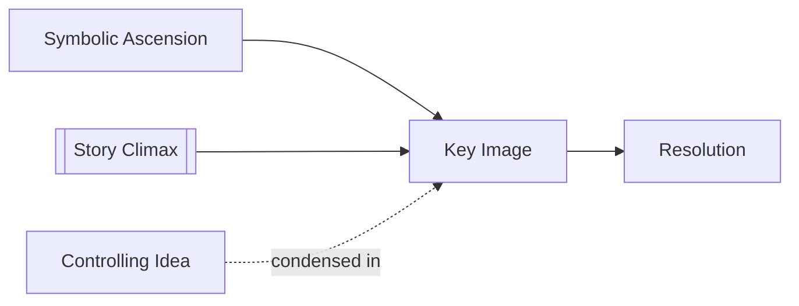

# Key Image

> 中文版：[[wiki/zh/concepts/key-image|中文]]

## Definition
A **Key Image** is the culminating image that concentrates a story's meaning and emotional force into a single memorable visual.

## McKee's Argument
Borrowing Truffaut's demand for "spectacle and truth," McKee argues that a great ending should resolve not only action but image. The key image acts like the coda of a symphony: when remembered, it calls the whole work back into the mind.

## How It Works

## Film Examples
- **[[the-deer-hunter]]** — The mountain confrontation turns into an archetypal image of hunter and mercy.
- **[[the-terminator]]** — Sarah's transformation is sealed through mythic visual framing.
- *Greed* and *The Conversation* are McKee's emblematic examples of ending by unforgettable image.

## Relationship to Other Concepts
- [[story-climax]] — The key image is often located inside the climax.
- [[controlling-idea]] — The image should echo the story's deepest meaning.
- [[symbolic-ascension]] — Composition prepares the image's archetypal charge.
- [[resolution]] — The image can bridge climax into aftermath.

## Common Mistakes
An image cannot save an unearned ending. Without structural and thematic preparation, it becomes decoration.

## Sources
- *Story* Chapter 13

