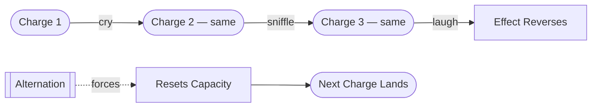

# Law of Diminishing Returns

> 中文版：[[wiki/zh/concepts/law-of-diminishing-returns|中文]]

## Definition

**Emotion peaks and burns.** The same emotional charge cannot be repeated back-to-back without losing — and eventually reversing — its effect. Three tragic scenes in a row: first we cry, then we sniffle, then we laugh.

## McKee's Argument

Because emotion is short-lived (peaks and burns), the storyteller must **alternate the charge**. A run of identical positive moments dulls into sentimentality; a run of identical negatives numbs into farce. The remedy is to install the opposite — even briefly — between events of the same valence. This is the engine behind [[act-rhythm]], [[unity-and-variety]], and the rationing logic of [[pacing]].

A single exception: **negative-to-negative works when the second event is so much worse that it retroactively makes the first seem positive.** Tyler's chemical burn in *Fight Club* illustrates this — the second negative (no escape from being a body that suffers) is catastrophic enough to recolor the first as "at least there was still escape."

## How It Works

1. **Identify the charge of the next scene.** Positive or negative.
2. **Look at the previous beat of the same valence.** If the audience just absorbed it, the next will diminish.
3. **Insert the opposite valence first** — a subplot scene, a contrast beat, a reversal — so the audience's capacity resets.
4. **Use mood to diversify what the arc must repeat.** If repetition is unavoidable, change the textures (light, music, tempo) so the *flavor* differs even when the charge is the same. See [[emotion-feeling-mood]].

## Film Examples

- **The Godfather Part II** — Coppola cross-cuts Vito's tender rise (positive) with Michael's cold decline (negative). Neither charge wears out because each is constantly relieved by its opposite.
- **Inception** — The four-layer climax solves the law structurally: each layer has a different mood (urgency, weightless strangeness, tactical clarity, grief), so the same rescue arc lands four times without dulling. See [[emotion-feeling-mood]].
- **The Dark Knight** — *Rachel/Harvey* sequence. Negative-to-negative succeeds because the Joker's reveal that Batman can save only one is catastrophic enough to recast the prior negative as relatively bearable.

## Relationship to Other Concepts

- Sets the rhythmic constraint behind [[act-rhythm]] (no two act climaxes repeat their predecessor's charge).
- Drives [[unity-and-variety]] at scene-sequence level.
- Explains why [[melodrama]] feels hollow: it stacks the same charge instead of alternating.
- Underpins the cross-cutting/[[subplot]] rationale: alternation is a structural device, not just stylistic.
- Without alternation, [[meaning-produces-emotion|meaning at climax]] cannot land — capacity has been spent.

## Common Mistakes

- **Stacking sentiment.** Three "tearjerker" beats in a row.
- **Stacking action.** Four chase scenes — the third bores; the fourth is comic.
- **Mistaking volume for charge.** Loud is not new. Mood reset, not amplitude, restores capacity.
- **Ignoring the negative-to-negative exception.** Avoiding repetition mechanically can flatten a deliberate descent like *Requiem for a Dream*.

## Sources
- *Story* Chapter 13 (emotion as value transition)
- `sources/supplementary/Emotion, feeling, and mood in screenwriting.html`
