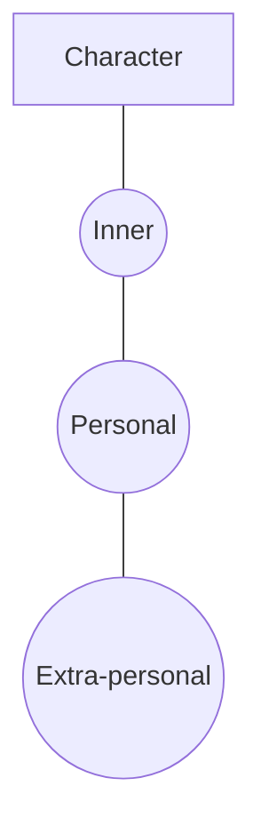

# Levels of Conflict

> 中文版：[[wiki/zh/concepts/levels-of-conflict|中文]]

## Definition
A character's world has three concentric rings of antagonism — the **three levels of conflict**:
1. **Inner Conflict** — mind, body, emotion at war with themselves.
2. **Personal Conflict** — intimates (family, friends, lovers) — relationships deeper than social role.
3. **Extra-personal Conflict** — institutions, other individuals in social roles, and the man-made or natural environment.

## McKee's Argument
Every [[the-gap|gap]] opens on one or more of these levels. Stories that operate on only one level are **complicated** (*Action*, *Soap Opera*, *Stream of Consciousness*). Stories that bring conflict onto all three levels simultaneously achieve **complexity**. The quantity of conflict in a life is constant; only its level shifts — "like squeezing a balloon."

## Film Examples
- **[[kramer-vs-kramer]]** — The French toast scene attacks all three levels in parallel.
- *James Bond* — Almost exclusively extra-personal.
- *Soap Opera* — Almost exclusively personal.

## Relationship to Other Concepts
- [[the-gap]] — Opens across these levels.
- [[law-of-conflict]] — The principle that powers them.
- [[complication-vs-complexity]] — The design choice among them.
- [[setting]] — "Level of Conflict" is one of its four dimensions.

## Common Mistakes
- Writing only "external" obstacles while leaving the inner and personal untouched.
- Mistaking *quantity* of conflict for *range* across levels.

## Sources
- *Story* Chapter 7 (definition); Chapter 9 (complication vs complexity)
