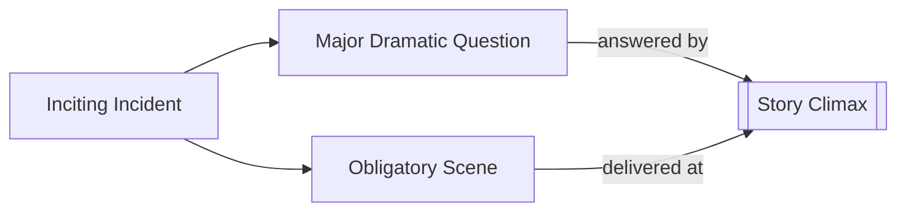

# Major Dramatic Question

> 中文版：[[wiki/zh/concepts/major-dramatic-question|中文]]

## Definition
The **Major Dramatic Question** (MDQ) is the variation on *"How will this turn out?"* provoked in the audience's mind by the [[inciting-incident]]. It is the cognitive hook that grips their curiosity from first act to climax.

## McKee's Argument
Witnessing the Inciting Incident does two things at once: it raises the MDQ in rational form, and it projects the [[obligatory-scene]] in imaginative form. Together these hold the audience's attention to the final answer. *Jaws*: will the sheriff kill the shark, or the shark the sheriff? *La Notte*: will Lidia go or stay?

## Film Examples
- *Jaws* — MDQ: Will the sheriff kill the shark?
- *Ordinary People* — MDQ: Will the family solve its problems or be torn apart?
- *Kramer vs. Kramer* — MDQ: Will Kramer keep his son?

## Relationship to Other Concepts
- [[inciting-incident]] — Raises the MDQ.
- [[obligatory-scene]] — The imaginative counterpart.
- [[story-climax]] — Answers the MDQ.

## Common Mistakes
- An inciting incident that fails to crystallize a question; audiences then don't know what to root for or against.

## Sources
- *Story* Chapter 8
