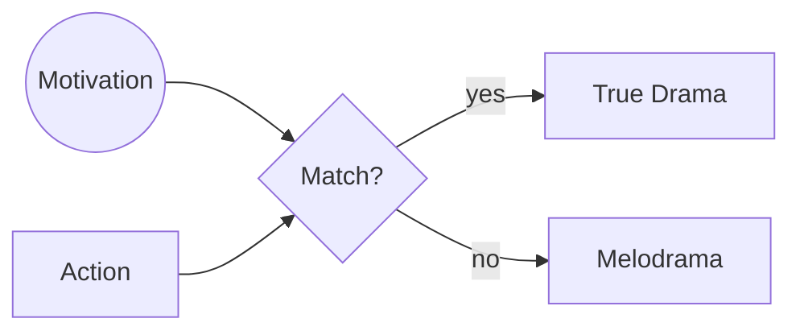

# Melodrama

> 中文版：[[wiki/zh/concepts/melodrama|中文]]

## Definition
**Melodrama** is the effect produced when an action's motivation is too small for its expression. It is not writing too big; it is writing with too little desire. The fix is not to shrink the scene but to deepen the force behind it.

## McKee's Argument
Nothing human beings do is *in itself* melodramatic; the daily news records acts of saintly self-sacrifice and monstrous cruelty. A scene feels melodramatic when the audience cannot believe that the motivation matches the action. Shakespeare and Bergman stage enormous scenes without melodrama because they first stage enormous motivations. "If you can imagine high drama or comedy, write it, but lift the forces that drive your characters to equal or surpass the extremities of their actions."

## How It Works
- **Diagnose upwards.** If a scene reads as melodrama, do not reduce the expression; audit motivation.
- **Build forces of antagonism first.** A character driven by overwhelming antagonism will earn enormous actions.
- **Don't retreat to minimalism.** Writing "little nothings" to avoid melodrama produces inert sketches that read as insincerity.
- **Remember the [[law-of-conflict]].** Friction under motivation prevents scale from collapsing into spectacle.

## Film Examples
- *King Lear* — The storm scene is the size of the world, the motivation bigger; no melodrama.
- *Cries and Whispers* — Extreme emotions, fully earned by decades of subtext and relational history.
- Any "weepie" that lays suffering on without earning it — the counter-example.

## Relationship to Other Concepts
- Prevented by strong [[forces-of-antagonism]] and the [[principle-of-antagonism]].
- A failure of [[dramatize-dont-explain]] only in reverse: the scene dramatizes, but without the invisible motivation that legitimizes it.
- Closely related to under-realized [[law-of-conflict]].

## Common Mistakes
- Writing small to appear subtle, when the real problem is that the underlying stakes are small.
- Adding tears, shouting, or violence to "heighten" a scene whose motivation has not been raised.
- Mistaking melodrama for a genre; it is a craft failure, not a category.

## Sources
- *Story* Chapter 16
