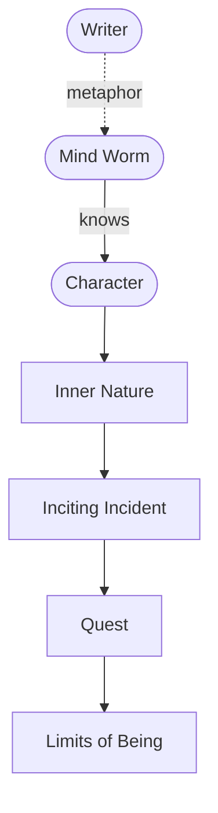

# The Mind Worm

> 中文版：[[wiki/zh/concepts/mind-worm|中文]]

## Definition
The **Mind Worm** is a medieval conceit McKee uses to describe the writer's own work: a creature that burrows into a person's mind, learns his dreams, fears, strengths and weaknesses, and then causes a single event in the world **tailored to him alone** — an event that will force him to use himself to the limit. The writer is a Mind Worm; the event he engineers is the [[inciting-incident]].

## McKee's Argument
Medieval scholars wrote in poetic code. The Mind Worm was their way of thinking about psychology: imagine a creature that could know a person completely, then design an experience perfectly fitted to him. For one protagonist that event might be finding a fortune; for another, losing one. "Like the Mind Worm, we explore the inscape of human nature, expressed in poetic code."

## How It Works
- **Know the character first.** What he hopes, fears, hides, wants consciously and unconsciously.
- **Engineer the event.** Design an inciting incident that could only dislodge *this* protagonist, not a generic one.
- **Match event to arc.** The event should exert precisely the pressure needed to push him into the [[character-dimension|dimensions]] you intend to reveal.
- **Keep the mystery.** The Mind Worm knows, but leaves room; do not over-explain motivation once the event is in motion.

## Film Examples
- *The Verdict* — Alcoholic lawyer handed exactly the case that could redeem or destroy him.
- *Rocky* — A small-time fighter offered the exact fight that forces his unconscious desire for self-worth to surface.
- *Kramer vs. Kramer* — A workaholic given a son and a wife who walks out.
- *The Godfather* — A son who refused the family business receives the event that can *only* pull him in.

## Relationship to Other Concepts
- Converts into the [[inciting-incident]] at the level of craft.
- Begins from knowledge of the [[protagonist]] and the [[character-dimension|dimensions]] to reveal.
- Sets the [[object-of-desire]] and the [[spine]] the protagonist will then pursue.

## Common Mistakes
- Treating the inciting incident as a generic disturbance (a death, a betrayal) instead of engineering the one event this specific protagonist could not refuse.
- Naming a motivation so precisely that the character shrinks — the Mind Worm *knows*, but the writer leaves mystery on the page.

## Sources
- *Story* Chapter 17
