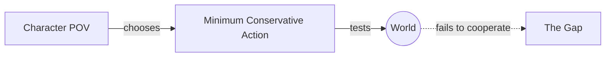

# Minimum Conservative Action

> 中文版：[[wiki/zh/concepts/minimum-conservative-action|中文]]

## Definition
Every character — including the protagonist — at any moment takes the **minimum, conservative action from his own point of view**: the least costly action he believes will provoke the reaction he wants from the world.

## McKee's Argument
Humanity is fundamentally conservative, as is all of nature: no organism expends more energy than necessary. What looks extreme from outside is often minimal from inside (the martial-arts hero kicking a door in). This matters structurally, because the [[the-gap|gap]] is defined *against* that minimal expectation — only when the world refuses the minimal action does story begin.

## Film Examples
- *Chinatown* — Gittes first tries a phone call threatening arrest; only when Evelyn resists does he escalate to violence.

## Relationship to Other Concepts
- [[the-gap]] — The gap is a violation of the minimum expectation.
- [[protagonist]] — Must be plausibly making minimal choices.

## Common Mistakes
- Characters who leap to extreme actions with no subjective justification.
- Objective writing ("what should this character do?") instead of subjective ("what would I do *if I were* this character?").

## Sources
- *Story* Chapter 7 ("The First Step")
