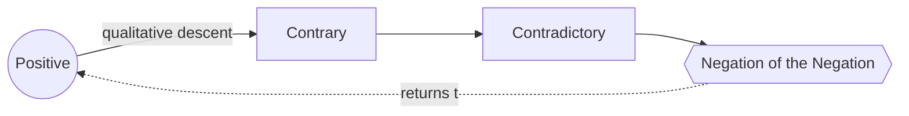

# Negation of the Negation

> 中文版：[[wiki/zh/concepts/negation-of-the-negation|中文]]

## Definition
The **Negation of the Negation** is a compound negative at the outer limit of human experience — a qualitatively worse state than the simple opposite of the positive value. In arithmetic two negatives cancel; in life they compound. The Negation of the Negation is what "just gets worse and worse and worse" until a story touches bottom.

## McKee's Argument
Every story turns on a central value. Between the Positive and its opposite lie degrees of darkness. The Contrary is somewhat negative but not fully opposed (unfairness vs. justice). The Contradictory is the direct opposite (injustice). The Negation of the Negation, however, is a *different kind* of bad — a state in which the frame of the value itself is corrupted. Injustice can be punished; *tyranny* makes justice unavailable. A liar hides the truth; a self-deceiver destroys the possibility of truth.

Stories that stop at the Contradictory can satisfy. Only those that reach the Negation of the Negation become sublime. "All other factors being equal, greatness is found in the writer's treatment of the negative side."

## How It Works
- **Name the central value** first (justice, love, truth, liberty, maturity, wealth, loyalty, consciousness, communication, ideal, intelligence, courage, sanctioned natural sex…).
- **Map four stations**, not two: Positive → Contrary → Contradictory → Negation of the Negation.
- **Descent is qualitative, not quantitative.** Find the form of that value that corrupts the frame itself.
  - *Justice → Unfairness → Injustice → Tyranny (might makes right).*
  - *Love → Indifference → Hate → Self-hatred.*
  - *Truth → White lie → Lie → Self-deception.*
  - *Liberty → Restraint → Slavery → Self-enslavement / slavery perceived as freedom.*
  - *Courage → Fear → Cowardice → Cowardice disguised as courage.*
- **Reach it somewhere.** The typical progression is Positive to Contrary in Act One, Contradictory in later acts, Negation of the Negation in the last act. Some stories invert this: *Casablanca* opens at the Negation of the Negation and climbs back; *Big* leaps to the Negation and then illuminates every other shade.

## Film Examples
- **[[chinatown]]** — The central value "sanctioned natural sex" is not ended by incest (the Contradictory) but by incest with the offspring of incest. That is why the antagonist is unkillable.
- **[[casablanca]]** — Opens in fascist tyranny (Negation of the Negation of freedom), Rick's self-hatred (of love), and self-deception (of truth), then works back to the Positive on all three.
- *Manchurian Candidate* — From consciousness down through unconsciousness and manipulation to damnation: a man destroyed by the discovery of what he has done under another's control.
- *Ordinary People* / *Shine* — Parental hate disguised as love: Negation of the Negation of love.

## Relationship to Other Concepts
- Final station of the [[value-progression]].
- The depth the [[principle-of-antagonism]] demands the [[forces-of-antagonism]] reach.
- Amplifies the [[dilemma]] at Crisis — the deeper the negative frame, the more irreconcilable the choice.
- Gives the [[controlling-idea]] its actual weight: only a story that has touched bottom can mean something surpassing.

## Common Mistakes
- Treating "the opposite" as the limit. Injustice is the Contradictory, not the bottom.
- Mechanical inversion (adding more of the same negativity) instead of a qualitatively worse state.
- Reaching the Negation of the Negation conceptually without dramatizing it concretely.
- Placing it so briefly that the audience does not feel the descent.

## Sources
- *Story* Chapter 14
