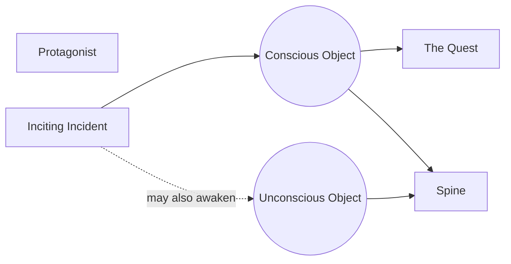

# Object of Desire

> 中文版：[[wiki/zh/concepts/object-of-desire|中文]]

## Definition
The **Object of Desire** is what the protagonist feels he lacks or needs to restore the balance of life — the physical, situational, or attitudinal target of his quest. It can be external (the shark's destruction in *Jaws*), internal (maturity in *Big*), or spiritual (a meaningful life in *Tender Mercies*).

## McKee's Argument
To understand the Quest form of any story you need only identify the protagonist's Object of Desire. Penetrate his psychology and find an honest answer to *"What does he want?"* A complex protagonist has two objects: a **conscious** one and a contradictory **unconscious** one. The deepest object — conscious when only one exists, unconscious when both — becomes the [[spine]].

## Film Examples
- **[[jaws]]** — Security from a marauding shark.
- *Big* — Maturity.
- *Moonstruck* — Someone to love.
- *Tender Mercies* — A meaningful life.

## Relationship to Other Concepts
- [[inciting-incident]] — Crystallizes the object.
- [[spine]] — The deepest object is the spine.
- [[the-quest]] — Defined by the object pursued.
- [[protagonist]] — Must know (consciously) what he wants.

## Common Mistakes
- Vague or shifting objects that leave the audience with no "what does he want?" to track.
- An unconscious object that is a mere synonym for the conscious one.

## Sources
- *Story* Chapter 7 & 8
