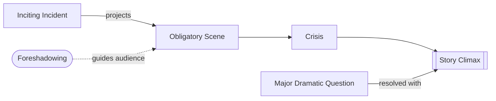

# Obligatory Scene

> 中文版：[[wiki/zh/concepts/obligatory-scene|中文]]

## Definition
The **Obligatory Scene** is the scene the audience intuitively knows must occur before the story can end. By Chapter 13, McKee clarifies that this scene normally crystallizes as the [[crisis]]: the protagonist's final face-to-face decision before the last action.

## McKee's Argument
Action genres project the obligatory scene vividly and immediately. Interior genres reveal it more slowly. In either case, the scene is the promised convergence of desire and strongest antagonism; the later chapters make clear that its deepest function is not just confrontation but choice.

## Film Examples
- **[[jaws]]** — Sheriff vs. shark in the open sea.
- **[[tender-mercies]]** — The death of Mac's daughter testing his fragile new life.
- *Ordinary People* — Calvin finally confronting Beth with the truth.

## Relationship to Other Concepts
- [[inciting-incident]] — Projects this scene.
- [[foreshadowing]] — The linking device between them.
- [[crisis]] — The obligatory scene usually becomes the crisis decision.
- [[story-climax]] — The decision taken here detonates into climax.
- [[major-dramatic-question]] — Settled at the obligatory scene/climax.

## Common Mistakes
- Staging the obligatory scene offscreen or secondhand (McKee: people peering out with binoculars while the sheriff fights the shark).
- Failing to escalate antagonism enough for the confrontation to feel obligatory.

## Sources
- *Story* Chapters 8 and 13
