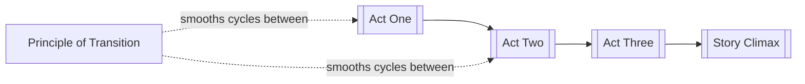

# Pacing

> 中文版：[[wiki/zh/concepts/pacing|中文]]

## Definition
**Pacing** is the shaping of pressure and release across a story so that tension rises, relaxes, and rises again instead of flattening the audience.

## McKee's Argument
McKee says stories should move with the pulse of life, not with monotone escalation. If tension only increases, the audience burns out before the ending. If it only relaxes, the story sags. Good pacing alternates intensities so the climax can arrive with force.

## How It Works

## Film Examples
- **[[tender-mercies]]** — A gentle pattern of release and re-tightening.
- **[[casablanca]]** — Breathers of wit and romance prevent the political and emotional stakes from exhausting the audience.

## Relationship to Other Concepts
- [[act-rhythm]] — Pacing works at the macro level of act movement.
- [[scene]] — Scene order and duration generate pace.
- [[story-climax]] — Pace exists to earn the force of the ending.
- [[principle-of-transition]] — Transitions help the audience ride the waves cleanly.

## Common Mistakes
Writers often confuse "more events" with faster pace. Pace is not quantity but modulation.

## Sources
- *Story* Chapter 12

