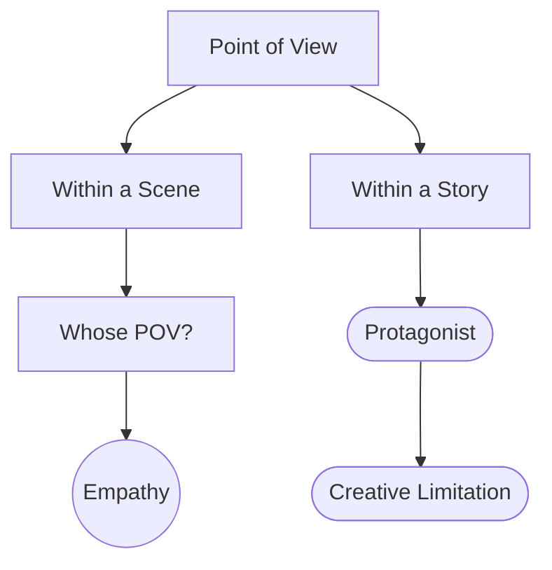

# Point of View

> 中文版：[[wiki/zh/concepts/point-of-view|中文]]

## Definition
**Point of View** has two senses in screenwriting. (1) *Within a scene*: the position in space from which events are imagined and described, which governs empathy and emotion. (2) *Within a story*: the writer's disciplined choice of whose experience to follow throughout the film — typically the [[protagonist]]'s.

## McKee's Argument
POV is a creative discipline, not a camera note. The easy way to tell a story is to hopscotch through time and space, scooping bits of information wherever convenient. The result is a sprawling story that loses tension. Shaping the whole story from the exclusive POV of the protagonist — the audience witnesses events only as the protagonist encounters them — is far harder and produces a tighter, more memorable character and film.

Within a scene, where the writer locates the imagination (on Jack, on Tony, alternating, or neutral) determines with whom empathy will sit.

## How It Works
- **Story level**: default to exclusive protagonist POV. The audience sees what the protagonist sees. Deviations should be deliberate (thriller POV on the killer, multi-plot by design).
- **Scene level**: pick whose reactions you follow. Four canonical options, as in the father/son scene:
  - Stay with A — audience empathizes with A.
  - Stay with B — audience empathizes with B.
  - Alternate — audience splits attention.
  - Neutral/profile — audience laughs at both.
- **Treat POV as a creative limitation.** Like genre convention or [[controlling-idea]], restricting POV forces deeper invention.
- **The more time with a character, the more opportunities to witness choice.** Empathy compounds; depth compounds.

## Film Examples
- *Taxi Driver* — Radical fidelity to Travis's POV; the audience is trapped inside his deterioration.
- *Chinatown* — The audience learns only what Gittes learns; key revelations are his discoveries.
- *Rashomon* — Deliberate rotation of POV; the payoff is epistemic, not empathic.

## Relationship to Other Concepts
- Concentrates the [[center-of-good]] by keeping the audience with the [[protagonist]].
- An instance of [[creative-limitation]] — a self-imposed constraint that forces better craft.
- Distinct from and should not be confused with the camera POV notation in a screenplay.

## Common Mistakes
- Floating POV used to paper over missing scenes or lazy exposition.
- Breaking the protagonist's POV to flatter a subplot without buying the extra bandwidth.
- Treating POV as a shot list rather than a discipline of imagination.

## Sources
- *Story* Chapter 16
