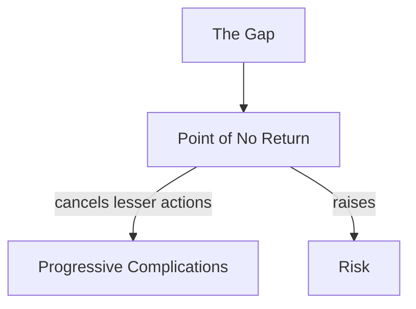

# Points of No Return

> 中文版：[[wiki/zh/concepts/points-of-no-return|中文]]

## Definition
A **Point of No Return** is the structural consequence of each gap: when a [[the-gap|gap]] opens, the audience realizes that minimal efforts will no longer work, and all action of that magnitude is permanently cancelled from the story's repertoire.

## McKee's Argument
Story progressions cannot retreat. Each gap tells the audience "that won't work again," so the next action must draw on greater willpower and greater [[risk]]. A story that offers the protagonist a new minor action after a major one has failed loses the audience's trust, because instinct knows smaller actions will fail where larger ones already have.

## Film Examples
- Any [[archplot]] — each act climax is a major point of no return; each sequence climax a moderate one.

## Relationship to Other Concepts
- [[the-gap]] — Each gap creates a point of no return.
- [[progressive-complications]] — The sequence of points of no return.
- [[risk]] — Rises as each point is passed.

## Common Mistakes
- Writing a new minor action after a major one has failed.
- Failing to let the audience feel the *cancellation* of lesser means.

## Sources
- *Story* Chapter 9 ("Act Design")
