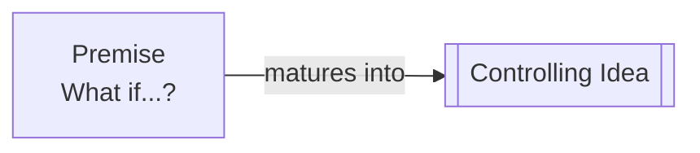

# Premise

> 中文版：[[wiki/zh/concepts/premise|中文]]

## Definition

The Premise is the idea that inspires the writer's desire to create a story. Unlike the [[controlling-idea|Controlling Idea]], it is rarely a closed statement — more likely an open-ended question: "What would happen if...?" Stanislavski called this the "Magic if..." — the daydreamy hypothetical that opens the door to imagination.

## Concept Map

## McKee's Argument

Premises come from anywhere: a friend's confession, a nightmare, a newspaper fact, a child's fantasy, even a purely technical exercise. What may inspire one writer will be ignored by another — the Premise awakens what waits within. It is not precious: as long as it contributes to story growth, keep it; should the telling take a turn, abandon the original inspiration to follow the evolving story. "The problem is not to start writing, but to keep writing and renewing inspiration. We rarely know where we're going; writing is discovery."

## How It Works

- "What would happen if a shark swam into a beach resort?" → JAWS
- "What would happen if a wife walked out on her husband and child?" → KRAMER VS. KRAMER
- Bergman's labyrinthitis: staring at a ceiling spot, imagining two faces intermingled; later seeing a nurse and patient comparing hands → PERSONA

## Relationship to Other Concepts

- [[controlling-idea]] — Premise begins the creative process; Controlling Idea completes it. They are the two bookends.

## Sources

- *Story* Chapter 6, "Premise"
