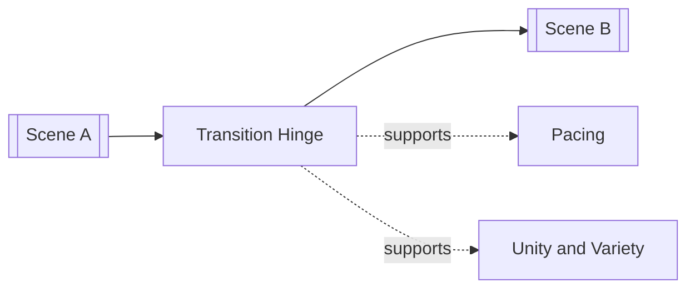

# Principle of Transition

> 中文版：[[wiki/zh/concepts/principle-of-transition|中文]]

## Definition
The **Principle of Transition** is the craft of linking one scene to the next through a hinge — something held in common or set in opposition.

## McKee's Argument
Without transitions, a story stumbles from unit to unit. Composition therefore needs a third element between scenes: a shared word, action, object, sound, light quality, character trait, or idea. That hinge can create continuity or counterpoint, but either way it keeps movement expressive.

## How It Works

## Film Examples
- **[[casablanca]]** — Transitions constantly braid romance, politics, and performance.
- **[[chinatown]]** — Counterpoint and repeated motifs push the investigation through tonal shifts.

## Relationship to Other Concepts
- [[scene]] — Transition works between scenes, not inside them.
- [[sequence]] — Effective transitions help sequences feel cumulative.
- [[pacing]] — They manage the audience's ride through pressure changes.
- [[unity-and-variety]] — Transitions preserve coherence while permitting contrast.

## Common Mistakes
Mechanical transitions may move the plot but not the audience. The strongest hinges carry meaning, tone, or irony.

## Sources
- *Story* Chapter 12

