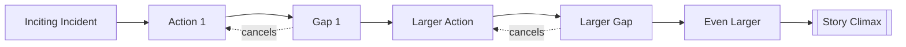

# Progressive Complications

> 中文版：[[wiki/zh/concepts/progressive-complications|中文]]

## Definition
Progressive Complications are the second element of the five-part story design: the great body of story spanning from the [[inciting-incident]] to the Crisis/Climax. To complicate progressively means to generate **more and more conflict** as the protagonist faces greater forces of antagonism, creating a succession of events that passes [[points-of-no-return]].

## McKee's Argument
After the inciting incident, each action provokes a reaction more powerful or different than expected, opening a [[the-gap|gap]] that cancels all lesser actions. The protagonist must reach deeper — more willpower, more capacity, more [[risk]] — at every stage. A story that retreats to actions of lesser quality or magnitude is in retrograde: this is the "soft belly" of Act Two where so many films go limp. The cure is not recycling but research — "to create forty to sixty scenes and not repeat yourself, you need to invent hundreds."

## How It Works

## Film Examples
- **[[kramer-vs-kramer]]** — From Mrs. Kramer's walkout through her return, the custody suit, and final resolution: a staircase of points of no return.

## Relationship to Other Concepts
- [[inciting-incident]] — Launches the progressions.
- [[points-of-no-return]] — The structural consequence of each gap.
- [[the-gap]] — Each progression is a widened gap.
- [[law-of-conflict]] — The principle that powers every progression.
- [[story-climax]] — What progressions build toward.

## Common Mistakes
- The "sloshing" Act Two: scenes of similar magnitude to Act One, which instincts tell us cannot succeed where smaller ones already failed.
- Substituting *quantity* of events for *escalation*.

## Sources
- *Story* Chapter 9 ("Act Design")
