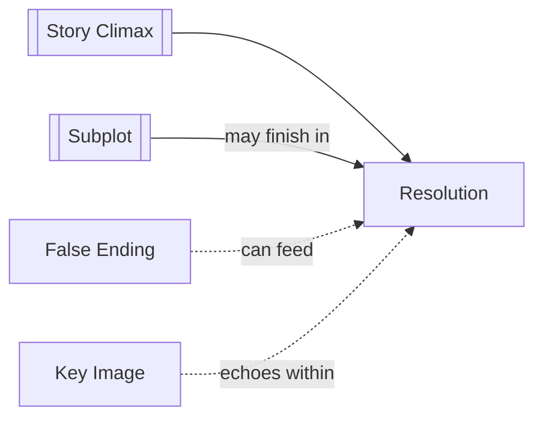

# Resolution

> 中文版：[[wiki/zh/concepts/resolution|中文]]

## Definition
**Resolution** is any material after the [[story-climax]] that settles remaining story movement and allows the audience to absorb the ending.

## McKee's Argument
McKee gives resolution three jobs: climaxing leftover [[subplot|subplots]], spreading the effects of the climax into a wider social field, and providing a courtesy pause so the audience does not leave in emotional whiplash. It is not padding; it is the controlled aftershock of the story.

## How It Works

## Film Examples
- **[[casablanca]]** — Rick's airport act resolves love, politics, and Renault's conversion in one sweep.
- **[[the-empire-strikes-back]]** — The aftermath does not close the war, but it settles the emotional shock enough to launch the next movement.

## Relationship to Other Concepts
- [[story-climax]] — Resolution follows the irreversible turn.
- [[subplot]] — Secondary lines may need their final beat here.
- [[false-ending]] — Some stories twist the resolution back toward the central action.
- [[key-image]] — The final image often lingers through the resolution.

## Common Mistakes
If resolution introduces unrelated material, it drains the climax. If it is absent, the audience may leave emotionally jarred instead of fulfilled.

## Sources
- *Story* Chapter 13

