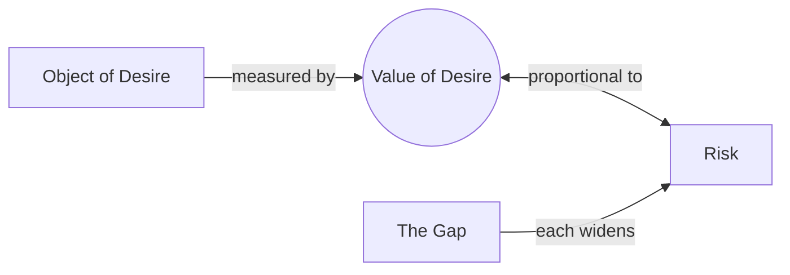

# Risk

> 中文版：[[wiki/zh/concepts/risk|中文]]

## Definition
**Risk** is what the protagonist stands to lose in pursuit of his desire. McKee's law: *the measure of the value of a character's desire is in direct proportion to the risk he's willing to take to achieve it; the greater the value, the greater the risk.*

## McKee's Argument
A simple test of any story: What is the risk? What's the worst thing that will happen if the protagonist doesn't get what he wants? If the answer is "life goes back to normal," the story is misconceived. Meaningful life is life at perpetual risk; story is the metaphor for that life.

## Film Examples
- Any [[archplot]] — stakes visibly rise through each act climax.

## Relationship to Other Concepts
- [[the-gap]] — Each gap raises risk.
- [[object-of-desire]] — Its value is measured by risk.
- [[progressive-complications]] — The structural escalation of risk.

## Common Mistakes
- Low-stakes scripts in which "life going back to normal" is a fine outcome.
- Forgetting that inner risks (soul, identity) can be as valuable as external ones.

## Sources
- *Story* Chapter 7 ("The Substance of Story"), the "ON RISK" section
