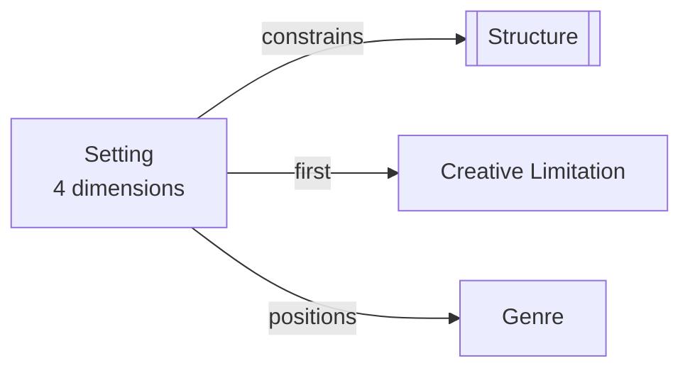

# Setting

> 中文版：[[wiki/zh/concepts/setting|中文]]

## Definition

A story's setting is four-dimensional: **Period** (place in time), **Duration** (length through time), **Location** (place in space), and **Level of Conflict** (position on the hierarchy of human struggles — from inner/unconscious conflicts up through personal, institutional, and environmental struggles).

## Concept Map

## McKee's Argument

Setting is not mere backdrop — it is the foundation that determines what events are possible within a story. Each fictional world creates its own cosmology, its own "rules" for how and why things happen. Once these causal principles are established, the writer is bound by a contract with the audience: break the internal laws and the audience rejects the work as illogical.

McKee insists there is "no such thing as a portable story." A divorce in the Louisiana Bayou looks nothing like one on Park Avenue or an Idaho potato farm. The writer who refuses to be specific about setting — claiming the story could happen anywhere — guarantees a clichéd result, because vagueness prevents the deep knowledge that produces originality.

## How It Works

1. **Period** — Determines the historical, cultural, and technological context. Contemporary? Historical? Hypothetical future?
2. **Duration** — How much time the story spans within characters' lives. Decades? A single dinner (as in *My Dinner with Andre*)?
3. **Location** — The specific physical geography: which city, which streets, which rooms.
4. **Level of Conflict** — The social/human dimension. Inner psychological conflicts? Personal relationships? Battles with institutions? Struggles against nature or the cosmos?

The writer must define all four dimensions with specificity, then research that world until they possess "commanding knowledge" — knowing every relevant detail so deeply that no question about the world could stump them.

## Film Examples

- **Dr. Strangelove** — Limited to three sets and eight characters, yet the story climaxes in planetary nuclear annihilation. Proves that a small, knowable world can contain the largest possible stakes.
- **Crime and Punishment** — McKee calls it "microscopic" — a tightly focused world that achieves extraordinary depth through limitation.
- **War and Peace** — Despite a vast Russian backdrop, it remains the focused tale of a handful of characters and their interrelated families.

## Relationship to Other Concepts

- [[structure]] — Setting constrains structure; only certain events are possible within a given world
- [[creative-limitation]] — Setting is the first and most fundamental creative limitation a writer faces
- [[genre]] — Genre further defines and limits the setting's possibilities

## Common Mistakes

- Refusing to be specific ("It's set in America" — but *which* America?)
- Assuming a story is "portable" and can work in any location
- Building a world too vast to truly know, leading to superficial treatment and cliché
- Breaking the internal laws of the fictional world after establishing them

## Sources

- *Story* Chapter 3, "Structure and Setting"
