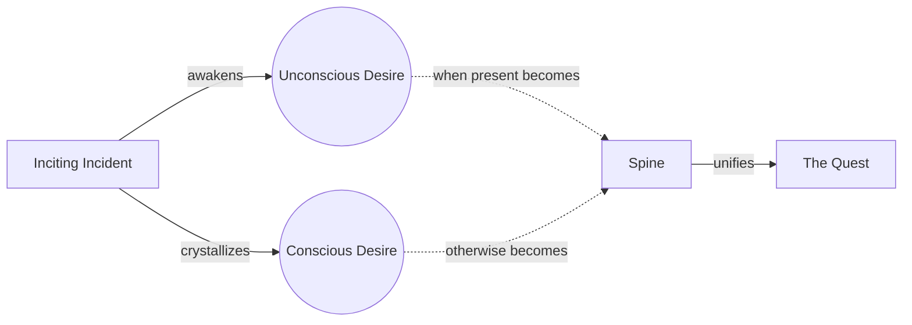

# Spine

> 中文版：[[wiki/zh/concepts/spine|中文]]

## Definition
The **Spine** (also known as Through-line or Super-objective) is the deep desire in, and effort by, the protagonist to restore the balance of life. It is the primary unifying force that holds every scene, image, and word of a story together.

## McKee's Argument
If the protagonist has only a conscious desire, that desire becomes the Spine (as in any Bond film: *to defeat the arch-villain*). If the protagonist also has an *unconscious* desire, then the unconscious desire becomes the Spine: it is more powerful, more durable, and allows the writer to change the character's conscious goal without fracturing the story. Jonathan's conscious search in *Carnal Knowledge* is for "the perfect woman"; his unconscious spine is to humiliate and destroy women.

## Film Examples
- *Moby Dick* — Ishmael's unconscious need to face the destructive obsession he sees in Ahab.
- *The Crying Game* — Fergus's unconscious need to love and be loved.
- *Mrs. Soffel* — Her unconscious pursuit of the transcendent romantic experience.

## Relationship to Other Concepts
- [[object-of-desire]] — The spine is the *deepest* object of desire.
- [[inciting-incident]] — Awakens the spine.
- [[the-quest]] — The spine defines the quest's trajectory.
- [[protagonist]] — The spine belongs to the protagonist (or plural-protagonist).

## Common Mistakes
- Confusing a shifting conscious goal with a lack of spine.
- Writing a protagonist whose supposed unconscious desire matches his conscious desire — a redundant design.

## Sources
- *Story* Chapter 8 ("The Inciting Incident")
