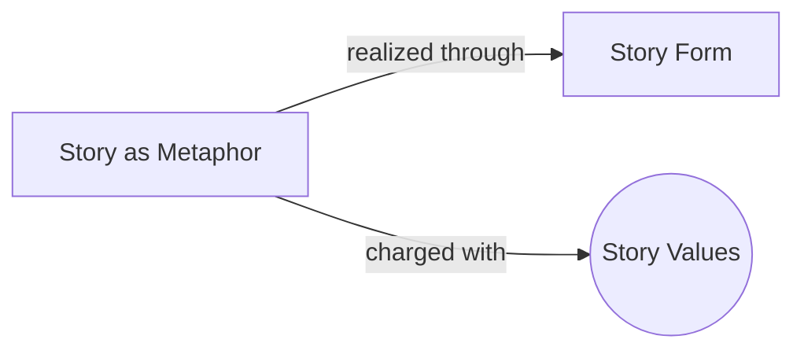

# Story as Metaphor

> 中文版：[[wiki/zh/concepts/story-as-metaphor|中文]]

## Definition

Story is metaphor for life. A storyteller is a life poet, an artist who transforms day-to-day living—inner life and outer life, dream and actuality—into a poem whose rhyme scheme is events rather than words. A story says: "Life is like *this!*"

## Concept Map

## McKee's Argument

McKee argues that story occupies a unique position between raw fact and pure abstraction. Writers of "portraiture" (slice-of-life realism) mistake verisimilitude for truth, believing that precise observation of daily facts equals truth-telling. But "fact, no matter how minutely observed, is truth with a small 't.' Big 'T' Truth is located behind, beyond, inside, below the surface of things." Writers of "spectacle" mistake kinesis for entertainment, hoping dazzling visuals will excite regardless of story.

Both extremes fail because they misunderstand the relationship of story to life. A story must abstract from life to discover its essences, but not become an abstraction that loses all sense of life-as-lived. It must be *like* life without being verbatim reportage.

## How It Works

The writer must balance two poles: the sensory power to observe life with acuity (perception) and the imaginative power to lift audiences beyond what is to what could be (imagination). Facts are neutral—"The weakest possible excuse to include anything in a story is: 'But it actually happened.'" Abstractions are equally neutral—editing rhythms, visual effects, and design have no meaning in themselves. The art lies in using both to express the living content of story.

## Film Examples

- **[[tender-mercies]]** — Not a verbatim report of a man's life, but a metaphor that captures an entire lifetime within a year's events
- McKee cites the many dramatizations of Joan of Arc (Anouilh's spiritual Joan, Shaw's witty Joan, Brecht's political Joan, Dreyer's suffering Joan) to show that the same facts yield completely different "truths" depending on the storyteller's vision

## Relationship to Other Concepts

- [[story-form]] — The universal form that makes a story a metaphor rather than mere reportage or collage
- [[story-values]] — Values are what make the metaphor meaningful; they are "the soul of storytelling"

## Common Mistakes

- **Portraiture:** Mistaking factual accuracy for truth. Piling up observed details without discovering the deeper pattern
- **Spectacle:** Mistaking kinetic excitement for meaning. Special effects and action without story substance
- Both result in stories that fail as metaphors for life

## Sources

- *Story* Chapter 1, "The Story Problem"
