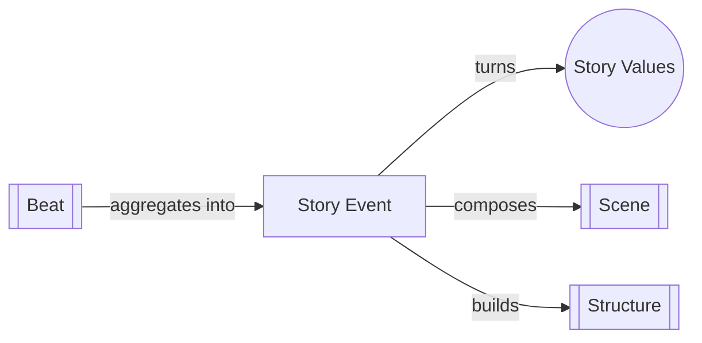

# Story Event

> 中文版：[[wiki/zh/concepts/story-event|中文]]

## Definition

A Story Event creates meaningful change in the life situation of a character that is expressed and experienced in terms of a value and achieved through conflict.

McKee builds this definition in three stages: (1) An event means *change*; (2) To make change meaningful, it must happen to a character and be expressed in terms of a [[story-values|value]]; (3) To be a *story* event, that change must be *achieved through conflict*, not coincidence.

## Concept Map

## McKee's Argument

Not all change qualifies as a story event. Rain falling on dry streets is change, but trivial. Rain in drought-stricken East Africa involves a value (life/death) and is meaningful—but if it falls by coincidence, it's not yet a story event. Only when a character struggles through inner, personal, social, and physical conflict to produce that change does it become a true story event. McKee uses *The Rainmaker* to illustrate the complete definition.

## How It Works

Ideally, every [[scene]] is a story event. To test: identify the value at stake, check if it shifts from beginning to end, and verify the shift was achieved through conflict (not coincidence, exposition, or mere activity). A scene with activity but no value change is a nonevent.

## Film Examples

- *The Rainmaker* — A man battling inner doubt, romantic rejection, social hostility, and nature itself to bring rain. Value: life/death. Achievement: through conflict on all four levels.
- The "lovers break up" scene — Value shifts from love/together to hate/apart through escalating conflict (six [[beat]]s of changing behavior)

## Relationship to Other Concepts

- [[story-values]] — Events express and shift values
- [[scene]] — Ideally every scene is a story event
- [[beat]] — Beats compose the internal mechanism of a story event within a scene
- [[structure]] — Structure is the composition of story events

## Common Mistakes

Building stories from coincidental events (rain just happens to fall). Also: writing scenes full of activity that don't create meaningful, conflict-driven change.

## Sources

- *Story* Chapter 2, "The Structure Spectrum"
