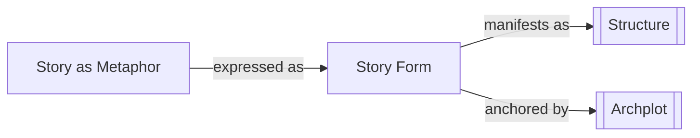

# Story Form

> 中文版：[[wiki/zh/concepts/story-form|中文]]

## Definition

Story Form is the universal, timeless shape that makes a work a story rather than portraiture or collage. Like the underlying form of music that distinguishes music from noise, or the cardinal principles of visual art that distinguish a painting from a doodle, story form shapes narrative into story. Across all cultures and through all ages, this innate form has been endlessly variable but changeless.

## Concept Map

## McKee's Argument

McKee insists that form does not mean "formula." There is no recipe that guarantees success. Story is too rich in mystery, complexity, and flexibility to be reduced to a formula—"Only a fool would try." Rather, a writer must *grasp* story form, which is inescapable. Despite the staggering variety among great stories (from *Tender Mercies* to *Raiders of the Lost Ark*, from *Hannah and Her Sisters* to *Monty Python*), all embody the same universal form. The audience responds to this deep form when it says, "What a good story!"

Each art is defined by its essential form. The writer's task is to understand and work within this form while finding unique expression—just as a composer works within the principles of musical composition while creating original music.

## How It Works

Story form manifests through [[structure]]—the selection and composition of events. It includes the hierarchy of [[beat]], [[scene]], [[sequence]], [[act]], and [[story-climax]]. But form is not a set of rules to follow mechanically; it is a set of principles to internalize until they become living craft. The conscious mind works on executing craft while the spontaneous subconscious surfaces—"Mastery of craft frees the subconscious."

## Film Examples

- **[[tender-mercies]]** and *Raiders of the Lost Ark* — Radically different films that both exemplify universal story form
- *Chinatown*, *8½*, *Rashomon*, *Casablanca*, *Modern Times* — All produce the same response: "What a great story!"

## Relationship to Other Concepts

- [[story-as-metaphor]] — Form is what enables story to function as metaphor
- [[structure]] — Structure is the concrete manifestation of form
- [[archplot]] — Classical Design represents the most universal expression of story form

## Common Mistakes

Confusing form with formula. Believing that because all stories share form, any template or recipe can produce a story. Also: believing that rejecting form equals originality.

## Sources

- *Story* Chapter 1, "The Story Problem"
