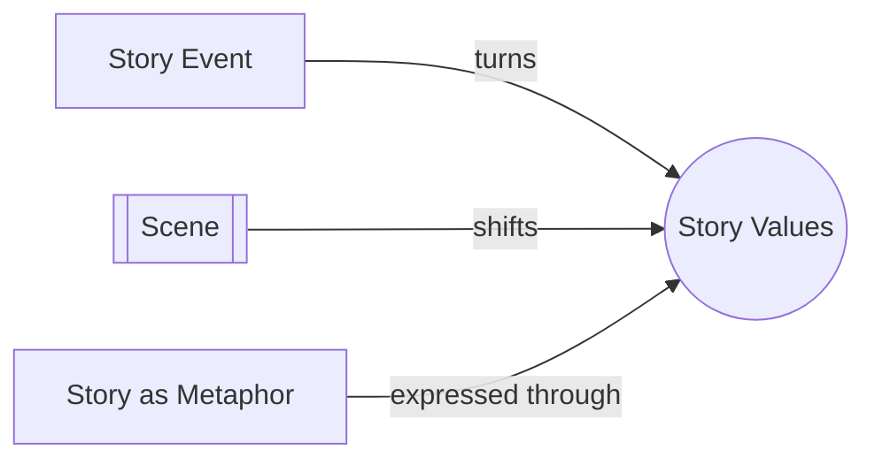

# Story Values

> 中文版：[[wiki/zh/concepts/story-values|中文]]

## Definition

Story Values are the universal qualities of human experience that may shift from positive to negative, or negative to positive, from one moment to the next. Examples: alive/dead, love/hate, freedom/slavery, truth/lie, courage/cowardice, loyalty/betrayal, wisdom/stupidity, hope/despair.

## Concept Map

## McKee's Argument

Values are the soul of storytelling. They are not "virtues" or narrow moralizing "family values"—they refer to the broadest sense of the idea. All binary qualities of experience that can reverse their charge at any moment are Story Values. They may be moral (good/evil), ethical (right/wrong), or simply charged with experiential weight (hope/despair is neither moral nor ethical, but we know which end we're at).

Story Events gain their meaning from values. A rainstorm in drought-stricken East Africa is meaningless as mere occurrence, but when it shifts the value from death to life, it becomes deeply significant. And when that shift is achieved through a character's conflict (as in *The Rainmaker*), it becomes a true [[story-event]].

## How It Works

Every [[scene]] must turn at least one value. At the beginning of a scene, identify the value at stake and its charge (positive or negative). At the end, check if the charge has shifted. If unchanged, the scene is a nonevent. Different genres turn on different values: Action genres on public values (freedom/slavery, justice/injustice); Education genres on interior values (self-awareness/self-deception).

## Film Examples

- *The Rainmaker* — Value at stake: life/death (drought vs. rain), achieved through the protagonist's conflict with inner doubt, society, and nature
- Action genres (*Die Hard*, *The Fugitive*) — Turn on public values
- Education genres (*Remains of the Day*, *The Accidental Tourist*) — Turn on interior values

## Relationship to Other Concepts

- [[story-event]] — Events are meaningful because they shift values
- [[scene]] — Every scene must turn at least one value
- [[story-as-metaphor]] — Values express the writer's perception of what matters in life

## Common Mistakes

Confusing Story Values with moral platitudes. Values are dynamic, binary qualities that shift—not static messages or themes. Also: writing scenes that don't shift any value (nonscenes).

## Sources

- *Story* Chapter 2, "The Structure Spectrum"
