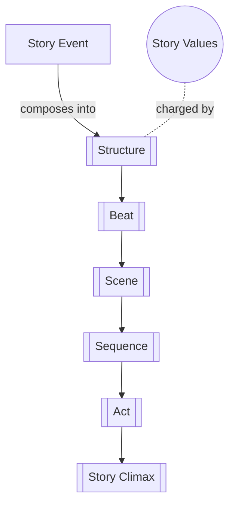

# Structure

> 中文版：[[wiki/zh/concepts/structure|中文]]

## Definition

Structure is a selection of events from the characters' life stories that is composed into a strategic sequence to arouse specific emotions and to express a specific view of life.

## Concept Map

## McKee's Argument

From the vast flux of a character's life story, the writer must make choices. No single element (character, action, mood, dialogue) builds a story in isolation. What the writer seeks are *events*, for an event contains all other elements. But event choices cannot be random—they must be *composed*, and "to compose" in story means much the same as in music: what to include, exclude, put before and after what?

The purpose of composition is dual: to express the writer's feelings and ideas, and to arouse emotions and understanding in the audience. Self-expression without audience engagement becomes self-indulgence; ideas without clarity become solipsism.

## How It Works

Structure manifests through the story hierarchy: [[beat]] → [[scene]] → [[sequence]] → [[act]] → [[story-climax]]. At each level, events turn [[story-values]] with escalating magnitude. The writer builds from the smallest exchange of behavior (beat) through increasingly powerful reversals to the absolute, irreversible change of the story climax.

## Film Examples

- **[[tender-mercies]]** — Exquisitely structured inner journey; described as "plotless" by some reviewers but in fact masterfully plotted through difficult terrain

## Relationship to Other Concepts

- [[story-event]] — Structure is the composition of story events
- [[story-values]] — Events are composed to turn values strategically
- [[beat]], [[scene]], [[sequence]], [[act]], [[story-climax]] — The hierarchical levels of structure
- [[story-form]] — Structure is the concrete manifestation of story form

## Common Mistakes

Mistaking activity for structure. A script full of dialogue, action, and imagery but without strategic event composition has no structure—just material.

## Sources

- *Story* Chapter 2, "The Structure Spectrum"
