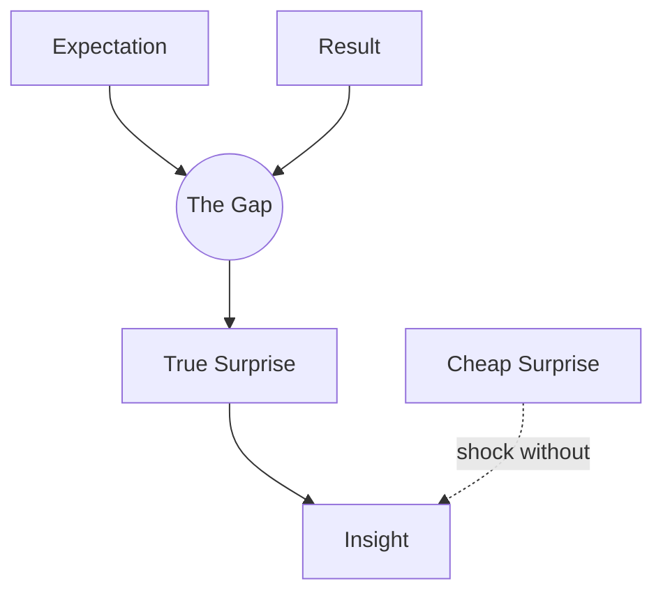

# Surprise

> 中文版：[[wiki/zh/concepts/surprise|中文]]

## Definition
**Surprise** is the reversal of expectation. McKee distinguishes two kinds: **true surprise**, which springs from a sudden revelation of the [[the-gap|Gap]] between expectation and result *and* is followed by insight; and **cheap surprise**, which exploits the audience's vulnerability in the dark for a jolt without meaning.

## McKee's Argument
The audience prays for surprise — an experience, not a confirmation. If what they expect to happen happens, or happens the way they expected it to happen, the story has failed. But surprise must be earned: a true surprise is always followed by "a rush of insight, the revelation of a truth hidden beneath the surface of the fictional world." Aristotle's complaint stands: "To be about to act and not to act is the worst. It is shocking without being tragic."

## How It Works
- **Start from the Gap.** True surprise is the Gap suddenly revealed — the character and audience realize that the world is not as it seemed.
- **Pay with insight.** After the reversal, the audience must *understand* something new. Without insight, the shock evaporates.
- **Reserve cheap surprise for genres that convention-ally use it** (Horror, Fantasy, Thriller). Outside those, cheap surprise is a writing failure pretending to be craft.
- **Turning points are the natural home of true surprise.** Build expectation, then reverse it on the turn.

## Film Examples
- *Chinatown* — "She's my sister and my daughter." The reversal explodes and a new understanding of the whole film rushes in.
- *The Empire Strikes Back* — "I am your father." Same shape.
- *A Fish Called Wanda* — Comic surprise: the family walks in during the striptease. The Gap opens and erupts as laughter.
- *My Favorite Season* (counter-example) — A horrific POV shock that is revealed to be a dream; cheap surprise in a serious domestic drama.

## Relationship to Other Concepts
- Fueled by the [[the-gap]] and delivered via the [[turning-point]].
- Service to the doctrine of [[inevitable-and-unexpected]] — surprise without inevitability is random; inevitability without surprise is formula.
- Modulated by [[mystery-suspense-dramatic-irony]] — Mystery hides facts and pays off at the Climax; Suspense shares facts and surprises on outcome; Dramatic Irony surprises about the *why* of what we already know.

## Common Mistakes
- Confusing shock with surprise.
- Reversals that imply no new truth about the world or the characters.
- Using surprise to cover holes in motivation.
- Over-relying on surprise at small beats, leaving the major turning points with nothing left.

## Sources
- *Story* Chapter 16
