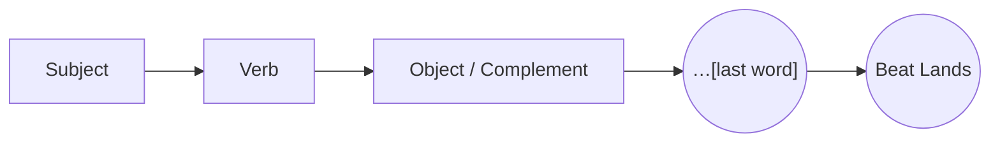

# Suspense Sentence

> 中文版：[[wiki/zh/concepts/suspense-sentence|中文]]

## Definition
A **suspense sentence** (periodic sentence) delays its meaning until the very last word, forcing both actor and audience to listen to the end. It is the preferred grammatical shape of screen [[dialogue]].

## McKee's Argument
Ill-written dialogue lets useless words — especially prepositional phrases — float to the ends of sentences; meaning lands somewhere in the middle and the last second or two of speech is boredom. The actor across the screen loses a cue; the audience's eye wanders. The periodic sentence reverses this: meaning sits at the end, where the pause naturally falls. "If you didn't want me to do it, why'd you give me that… *kiss.*"

## How It Works
- **Load the payoff word last.** Grammatically and emotionally.
- **Prune prepositional tails.** If a phrase floats past the meaning, it drags the cue.
- **Listen to the cue rhythm.** Actors rewrite dialogue to make cueing snappy; write it that way to begin with.
- **Especially in long speeches.** Each fragment of a broken long speech ideally lands on a suspense word.

## Film Examples
- *Amadeus* — Shaffer's dialogue: "All I ever wanted was to sing to… *God.*" Virtually every line is a suspense sentence.
- Classical tragic soliloquy — Shakespeare's lines famously end on the operative word.

## Relationship to Other Concepts
- A syntactic rule of [[dialogue]].
- Allied with [[pacing]] at the line level — a tight cue rhythm sustains momentum.
- Complementary to [[silent-screenplay]]: when speech must exist, make every line carry weight to the last syllable.

## Common Mistakes
- Leaving qualifiers ("in the morning," "you know," "at the bank") dangling after the meaning.
- Repeating meaning mid-sentence.
- Lines whose real charge is in the middle, slack at the end.

## Sources
- *Story* Chapter 18
