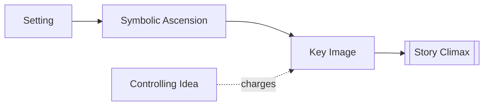

# Symbolic Ascension

> 中文版：[[wiki/zh/concepts/symbolic-ascension|中文]]

## Definition
**Symbolic Ascension** is the compositional rise from literal, ordinary images toward images that carry universal or archetypal force.

## McKee's Argument
McKee does not ask writers to label things as symbols. Instead, he asks them to let imagery gather meaning gradually. A story may begin with apparently ordinary settings and actions, then climb until those same kinds of images resonate as myth, ritual, sacrifice, or fate.

## How It Works

## Film Examples
- **[[the-deer-hunter]]** — Hunting images rise toward sacrifice, mercy, and human self-recognition.
- **[[the-terminator]]** — Los Angeles becomes a labyrinth and Sarah a mythic mother figure.

## Relationship to Other Concepts
- [[controlling-idea]] — Symbolic ascent intensifies the story's meaning.
- [[key-image]] — The ascent often culminates in a key image.
- [[story-climax]] — The greatest symbolic charge usually arrives at the climax.
- [[setting]] — Symbolism often grows out of setting rather than being pasted on.

## Common Mistakes
Heavy-handed symbolism kills symbolism. Once the writer points and announces the symbol, its force leaks away.

## Sources
- *Story* Chapter 12

