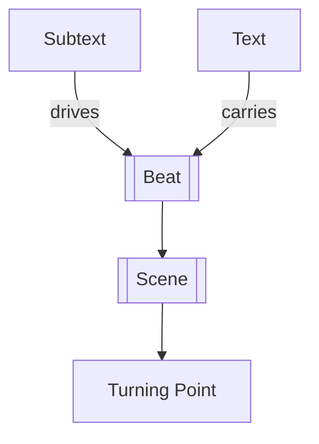

# Text and Subtext

> 中文版：[[wiki/zh/concepts/text-and-subtext|中文]]

## Definition
**Text** is the sensory surface of a scene — what is said and done. **Subtext** is the hidden life beneath that surface — the motives, fears, desires, and truths masked by behavior.

## McKee's Argument
McKee insists that scenes work because life itself is double. People rarely say exactly what they mean, and often do not fully know what they mean. The audience enjoys story partly because it can read through the visible layer into the concealed one.

## How It Works

## Film Examples
- **[[casablanca]]** — Rick and Ilsa speak around the wound while the wound does the real dramatic work.
- **[[kramer-vs-kramer]]** — The breakfast scene is about food on the surface and failed adulthood underneath.

## Relationship to Other Concepts
- [[beat]] — Subtext is what gives beats their specific action quality.
- [[scene]] — A scene without subtext tends toward dead exposition.
- [[turning-point]] — Turns matter more when the hidden life is reinterpreted.
- [[dramatize-dont-explain]] — Subtext is one of dramatization's central tools.

## Common Mistakes
Writing dies "on the nose" when the character says the deepest thing directly and leaves actors nothing to play.

## Sources
- *Story* Chapter 11

