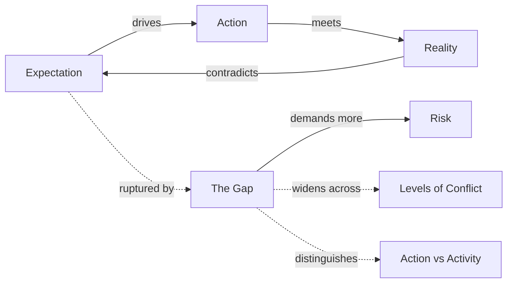

# The Gap

> 中文版：[[wiki/zh/concepts/the-gap|中文]]

## Definition
The Gap is the rift between **what a character expects** to happen when he takes an action and **what actually happens** — between **probability and necessity**, between the character's subjective view of the world and the objective reaction the world returns. It is, McKee argues, the substance of story itself.

## McKee's Argument
Story is not made of words. Language is only a medium. The stuff of story is the cleft that splits open when a character acts on what he believes to be true and reality answers with something larger, different, or worse. In life we mostly take "minimum, conservative actions" and more or less get what we expect; this is the great mass of daily experience. Story is exactly the opposite: we concentrate on *that moment, and only that moment*, in which action provokes forces of antagonism rather than cooperation.

The gap is simultaneously the **substance** of story (where emotional truth lives) and the **source of story energy** — every time the gap opens for the character, it opens for the audience, producing the "Oh my God / Oh yes / Oh no" response.

## How It Works
1. The [[protagonist]] chooses a [[minimum-conservative-action]] believing it will yield a positive step.
2. The world reacts differently or more powerfully than expected: the gap opens.
3. The character must now gather more willpower, take a larger action, and accept greater [[risk]].
4. This repeats across [[levels-of-conflict]] — inner, personal, extra-personal — until the story reaches its limit.
5. Each gap is a [[points-of-no-return|point of no return]]; lesser actions are permanently cancelled.

## Film Examples
- **[[chinatown]]** — The Act Two climax: Gittes's every expectation (Evelyn will confess to murder, lie about the "other woman") is overturned beat by beat. "She's my sister and my daughter" is the gap that rewrites the entire film.
- **[[kramer-vs-kramer]]** — The French toast scene: every confident step (cook eggs, feed son, restore order) meets its opposite, across all three [[levels-of-conflict]] at once.

## Relationship to Other Concepts
- [[risk]] — The gap raises risk; the value of a desire is measured by what the character will risk across it.
- [[action-vs-activity]] — Action opens a gap; activity does not.
- [[progressive-complications]] — A structured sequence of gaps, each larger than the last.
- [[points-of-no-return]] — The gap's structural consequence: nothing smaller will now suffice.
- [[levels-of-conflict]] — Gaps can open on any of three levels, or across all three at once.

## Common Mistakes
- Writing "activity" rather than action — scenes where expectation equals result (a "pointless pace killer").
- Treating the gap as merely cause-and-effect rather than the meeting point of spirit and world.
- Closing gaps too quickly; the gap must *widen* through progressive complications before it closes at climax.

## Sources
- *Story* Chapter 7 ("The Substance of Story")
- *Story* Chapter 9 ("Act Design") — the gap formalized as progressive complications
