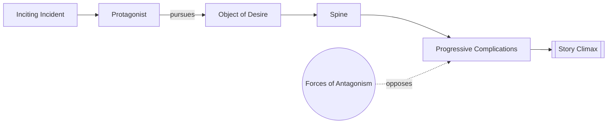

# The Quest

> 中文版：[[wiki/zh/concepts/the-quest|中文]]

## Definition
**The Quest** is McKee's claim that, beneath all variation of genre and form, there is only one story: *An event throws a character's life out of balance, arousing in him the conscious and/or unconscious desire for that which he feels will restore balance, launching him on a Quest for his Object of Desire against forces of antagonism (inner, personal, extra-personal). He may or may not achieve it.*

## McKee's Argument
Like the twelve notes of music, the essential form of story is simple — and from it everything we call story has been composed since the dawn of humanity. To see your own story as a Quest, identify the [[protagonist]]'s [[object-of-desire]]: that alone reveals the arc the [[inciting-incident]] sends him on.

## Film Examples
- *Jaws* — Quest: security from the shark.
- *Big* — Quest: maturity.
- *Tender Mercies* — Quest: a meaningful life.

## Relationship to Other Concepts
- [[inciting-incident]] — Launches the quest.
- [[object-of-desire]] — Defines the quest.
- [[spine]] — The quest's unifying force.
- [[progressive-complications]] — The body of the quest.

## Common Mistakes
- Treating "Quest" as a genre synonym for adventure; McKee means the universal deep form.

## Sources
- *Story* Chapter 8 ("The Inciting Incident")
