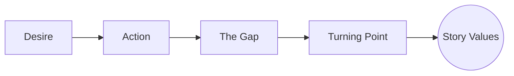

# Turning Point

> 中文版：[[wiki/zh/concepts/turning-point|中文]]

## Definition
A **Turning Point** is the moment a [[scene]] or larger unit splits expectation from result and flips a character's value-charged condition in a meaningful way.

## McKee's Argument
McKee treats the turning point as the engine of scene design. A character acts toward a desire, reality reacts in an unforeseen way, and a [[the-gap|gap]] opens. That shock produces surprise, then curiosity, then insight as the audience reinterprets what it has already seen.

## How It Works

The turn is not merely a surprise beat. It must redirect the story. Once the value changes, the writer owes the audience a new line of action and a new set of consequences.

## Film Examples
- **[[trading-places]]** — Billy Ray's life flips from street survival to financial access.
- **[[wall-street]]** — Bud Fox's choice transforms both fortune and integrity.
- **[[chinatown]]** — Evelyn's confession turns the film onto a darker truth.

## Relationship to Other Concepts
- [[the-gap]] — The mechanism inside every turning point.
- [[scene]] — The unit most immediately built around turning points.
- [[story-values]] — What turns from positive to negative or the reverse.
- [[setup-and-payoff]] — What makes the turn feel earned rather than arbitrary.

## Common Mistakes
Writers mistake information, surprise, or activity for a turn. If no value changes, the scene may be lively but it does not truly turn.

## Sources
- *Story* Chapters 10–11

