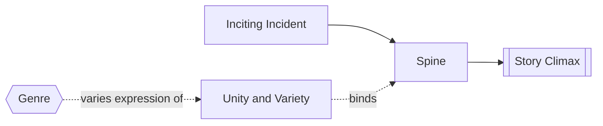

# Unity and Variety

> 中文版：[[wiki/zh/concepts/unity-and-variety|中文]]

## Definition
**Unity and Variety** is the compositional demand that a story feel causally whole while still offering contrast, freshness, and tonal richness from scene to scene.

## McKee's Argument
Unity means the ending feels locked to the beginning: because of the [[inciting-incident]], the [[story-climax]] had to happen. Variety means the journey cannot repeat one note. Comedy, politics, romance, action, and mood may differ greatly as long as they remain subordinate to the same [[spine]].

## How It Works

## Film Examples
- **[[casablanca]]** — Romance, politics, wit, and music coexist inside one locked story line.
- **[[jaws]]** — The shark attack causally compels the final confrontation, even as the film varies tone and setting.

## Relationship to Other Concepts
- [[inciting-incident]] — The deep cause that locks the story.
- [[spine]] — The line of desire that preserves unity.
- [[story-climax]] — The proof that the design held together.
- [[genre]] — One major source of controlled variety.

## Common Mistakes
Variety without unity feels episodic. Unity without variety feels mechanical and monotonous.

## Sources
- *Story* Chapter 12

