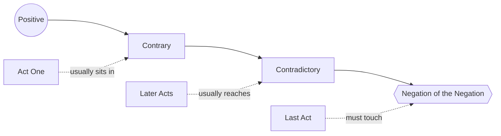

# Value Progression

> 中文版：[[wiki/zh/concepts/value-progression|中文]]

## Definition
A **value progression** is the patterned descent of a story's central value through four stations — **Positive → Contrary → Contradictory → [[negation-of-the-negation|Negation of the Negation]]** — that McKee diagnoses a story against. It is the map by which [[progressive-complications]] acquire depth rather than mere accumulation.

## McKee's Argument
Life is not yes/no. Between a positive value and its opposite are degrees of darkness, and the most negative state is not simply "the opposite" but a compound negative at the limit of human experience. A story that progresses through all four stations reaches the end of the line; a story that stops at the Contrary or Contradictory remains trivial.

## How It Works
- **Identify the preeminent value** at stake in the story (the one the Climax turns on).
- **Name the four stations** for that value. The Contrary is a partial negative; the Contradictory is the direct opposite; the [[negation-of-the-negation|Negation of the Negation]] is a qualitatively worse compound.
- **Chart the story's descent.** Typical progression:
  - Act One: Positive → Contrary.
  - Middle Acts: Contrary → Contradictory.
  - Last Act: Contradictory → Negation of the Negation, then either an ironic return to the Positive or a tragic end at the bottom.
- **Inverted progressions are legal.** *Casablanca* opens at the Negation of the Negation on three values and climbs back; *Big* leaps to the Negation and then illuminates the shades.
- **Pair with the positive mirror.** Good → Better → Best → Perfect runs parallel but, McKee notes, rarely helps the storyteller: it is the negative axis that generates force.

## Film Examples
- **[[casablanca]]** — Freedom, love, integrity each run the full progression in reverse: opens at the Negation of the Negation (tyranny, self-hatred, self-deception) and climaxes at the Positive.
- **[[chinatown]]** — Sanctioned natural sex: frowned-upon relations (Contrary) → incest (Contradictory) → incest with the offspring of incest (Negation of the Negation).
- *Missing* — Justice: unfairness (Contrary) → injustice (Contradictory) → tyranny (Negation of the Negation).
- *And Justice for All* — Runs the progression and comes back out the other side.

## Relationship to Other Concepts
- Structures the [[forces-of-antagonism]] under the [[principle-of-antagonism]].
- Provides the depth axis for [[progressive-complications]]: complications must descend the declension, not repeat at one level.
- Names where the [[controlling-idea]] finally lands — a story's meaning is set by the station the Climax turns on.
- Applies to each of the [[story-values]] present in the telling.

## Common Mistakes
- Two stations only (positive/negative), collapsing Contrary and Contradictory.
- Stopping at the Contradictory and declaring the ending "dark enough."
- Reaching the Negation of the Negation in name only (e.g., a line of dialogue) without dramatization.
- Repeating one station across acts instead of descending.

## Sources
- *Story* Chapter 14
