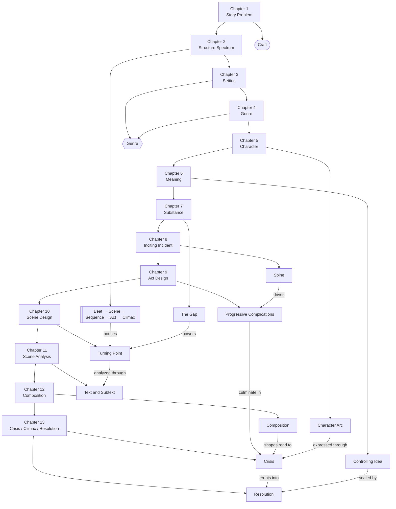

# Overview: McKee's Story Framework (Chapters 1–13)

> 中文版：[[wiki/zh/overview|中文]]

## The Central Argument

Across Chapters 1–13, Robert McKee argues that **story is a craft of meaningful, value-changing choices arranged into escalating form**. The early chapters define story's foundations; the later chapters turn those principles into concrete engines for incident, scene, composition, and ending.

## Master Concept Map

## The Arc of the Book So Far

### Chapters 1–6: Definition, World, Character, Meaning
McKee begins by defending [[craft-maximizes-talent|craft]] against mysticism and formula. He establishes the structural hierarchy in [[chapter-02-the-structure-spectrum|Chapter 2]], then shows how story is shaped by [[setting]], [[genre]], [[character-arc]], and [[controlling-idea]]. By the end of Part One, story is defined as a meaningful structure of value change.

### Chapters 7–9: Launch, Pursuit, Escalation
[[chapter-07-the-substance-of-story|Chapter 7]] gives story its generative unit: [[the-gap]]. [[chapter-08-the-inciting-incident|Chapter 8]] launches the [[spine]], raises the [[major-dramatic-question]], and projects the [[obligatory-scene]]. [[chapter-09-act-design|Chapter 9]] then shapes the long body of pursuit through [[progressive-complications]], [[points-of-no-return]], and the [[law-of-conflict]].

### Chapters 10–11: Scene Mechanics and Diagnosis
[[chapter-10-scene-design|Scene Design]] makes the scene a precise machine: a [[scene-objective]], resistance, a gap, and a [[turning-point]]. [[chapter-11-scene-analysis|Scene Analysis]] slows that machine down so the writer can inspect [[beat|beats]], [[text-and-subtext]], and the before/after state of the value at stake.

### Chapters 12–13: Composition and the Final Movement
[[chapter-12-composition|Composition]] asks how scenes are arranged into waves, contrasts, and symbolic lift through [[unity-and-variety]], [[pacing]], [[symbolic-ascension]], and the [[principle-of-transition]]. [[chapter-13-crisis-climax-resolution|Chapter 13]] completes the ending model: true choice is [[dilemma]], the last decision is [[crisis]], the final irreversible action is the [[story-climax]], and the aftershock is [[resolution]].

## The Emerging Framework

1. **Story is craft, not mysticism.**
2. **Structure is hierarchical, but every level turns on value change.**
3. **World, genre, and character are not accessories; they shape structure from within.**
4. **Scenes are miniature stories, not containers for exposition.**
5. **Meaning is not stated but proved by the arrangement of events.**
6. **Endings work because choice and meaning precede spectacle.**

## Key Tensions

- **Form vs. Formula** — Principles generate; formulas imitate.
- **Craft vs. Talent** — Each without the other becomes inert or chaotic.
- **Surface vs. Depth** — Text, characterization, and spectacle matter only when backed by hidden action and meaning.
- **Expectation vs. Result** — The gap powers both scenes and endings.
- **Freedom vs. Necessity** — Creation feels free; the finished story must feel locked.

## What This Arc Suggests

By Chapter 13, McKee has completed a major loop: he has defended craft, defined structure, placed it in world and meaning, and then drilled down into scene design, composition, and endings. The later chapters should now deepen adjacent craft problems — exposition, dialogue, character systems, and the writer's working process — from a dramatically complete core.

