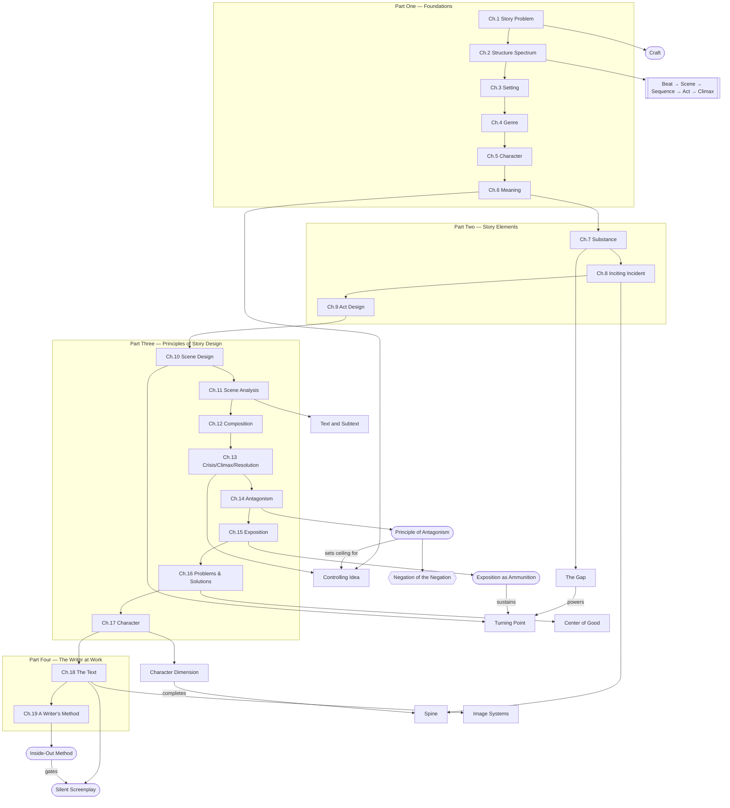

# Overview: McKee's Story Framework (Chapters 1–19)

> 中文版：[[wiki/zh/overview|中文]]

## The Central Argument

Across Chapters 1–19, Robert McKee argues that **story is a craft of meaningful, value-changing choices arranged into escalating form, then executed first inwardly and last in words**. The early chapters define story's foundations; the middle chapters convert those principles into engines for incident, scene, composition, and ending; the final chapters expose the deepest negative side of antagonism, the rationing of information, the construction of character and text, and — last — the writing process itself.

## Master Concept Map

## The Arc of the Book

### Chapters 1–6: Definition, World, Character, Meaning
McKee defends [[craft-maximizes-talent|craft]] against mysticism. He establishes the structural hierarchy in [[chapter-02-the-structure-spectrum|Chapter 2]], then shows how story is shaped by [[setting]], [[genre]], [[character-arc]], and [[controlling-idea]]. Story is defined as a meaningful structure of value change.

### Chapters 7–9: Launch, Pursuit, Escalation
[[chapter-07-the-substance-of-story|Chapter 7]] gives story its generative unit: [[the-gap]]. [[chapter-08-the-inciting-incident|Chapter 8]] launches the [[spine]], raises the [[major-dramatic-question]], and projects the [[obligatory-scene]]. [[chapter-09-act-design|Chapter 9]] shapes the long body of pursuit through [[progressive-complications]], [[points-of-no-return]], and the [[law-of-conflict]].

### Chapters 10–13: Scene, Composition, Ending
[[chapter-10-scene-design|Scene Design]] makes the scene a precise machine; [[chapter-11-scene-analysis|Scene Analysis]] inspects [[beat|beats]] and [[text-and-subtext|subtext]]. [[chapter-12-composition|Composition]] arranges scenes into [[unity-and-variety|waves]], [[pacing]], [[symbolic-ascension]], and [[principle-of-transition|transitions]]. [[chapter-13-crisis-climax-resolution|Chapter 13]] completes the ending: [[dilemma]] → [[crisis]] → [[story-climax]] → [[resolution]].

### Chapter 14: The Negative Side
[[chapter-14-the-principle-of-antagonism|Chapter 14]] is the book's hinge. The [[principle-of-antagonism]] sets the ceiling on every previous element: a story rises only as far as its [[forces-of-antagonism]] force it. The [[value-progression]] (Positive → Contrary → Contradictory → [[negation-of-the-negation|Negation of the Negation]]) gives the writer a tool to drive the story all the way to the end of the line.

### Chapters 15–17: Information, Craft Failures, Character Systems
[[chapter-15-exposition|Chapter 15]] reframes information as ammunition: [[exposition-as-ammunition|exposition rationed and detonated]] rather than dumped, with [[flashback]] used only when the present cannot carry the load. [[chapter-16-problems-and-solutions|Chapter 16]] catalogues the recurring craft failures — the [[hole]], the missing [[center-of-good]], confusing [[surprise]] with [[coincidence]], slack [[point-of-view]], naive [[adaptation]], unearned [[melodrama]], and the special demands of [[comic-design]]. [[chapter-17-character|Chapter 17]] builds character as a system: the [[mind-worm]] of empathy, [[character-dimension]] as consistent contradiction, and a polarized [[cast-design]].

### Chapters 18–19: Text and Method
[[chapter-18-the-text|Chapter 18]] is the *last* layer: [[dialogue]], [[description]], [[image-systems]], the [[suspense-sentence]], and the [[silent-screenplay]] test. [[chapter-19-a-writers-method|Chapter 19]] reveals the working process that all the earlier principles imply: the [[a-writers-method|inside-out method]] — [[step-outline]] → pitch → [[treatment]] → screenplay — with dialogue written *last*.

## The Emerging Framework

1. **Story is craft, not mysticism.**
2. **Structure is hierarchical, but every level turns on value change.**
3. **World, genre, and character are not accessories; they shape structure from within.**
4. **Meaning is not stated but proved by the arrangement of events.**
5. **Endings work because choice and meaning precede spectacle.**
6. **A story rises only as far as its antagonism forces it.**
7. **Information is ammunition, not exposition.**
8. **Character is a system of consistent contradictions, not traits.**
9. **Text is the last layer, not the first.**
10. **Method is inside-out; dialogue is the final surface.**

## Key Tensions

- **Form vs. Formula** — Principles generate; formulas imitate.
- **Craft vs. Talent** — Each without the other becomes inert or chaotic.
- **Surface vs. Depth** — Text only matters when backed by hidden action and meaning.
- **Expectation vs. Result** — The gap powers both scenes and endings.
- **Positive vs. Negation of the Negation** — The story rises only as far as the negative side is built.
- **Inside vs. Outside** — Inner life precedes outer scene; outline precedes dialogue.
- **Freedom vs. Necessity** — Creation feels free; the finished story must feel locked.

## Closing the Loop

By Chapter 19, McKee has closed every loop the early chapters opened. Craft was defended (Ch.1) and then operationalized as a method (Ch.19). Structure was defined (Ch.2) and then armed with antagonism (Ch.14). Meaning was named (Ch.6), proved by event arrangement (Ch.7–13), guarded against melodrama and holes (Ch.16), and finally encoded in text and image (Ch.18). The book ends where every screenplay does: with the writer at the card table, building inside-out, postponing words until events, values, and subtext have been stress-tested.
