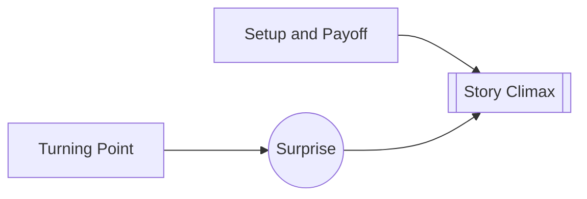

# Inevitable and Unexpected

> 中文版：[[wiki/zh/principles/inevitable-and-unexpected|中文]]

## The Principle
A satisfying ending feels, in retrospect, like the only possible ending — yet it arrives in a way the audience did not predict.

## McKee's Reasoning
This is Aristotle's test, revived by McKee. The story's setups, character logic, and world rules make the ending inevitable; the writer's management of gaps and withheld insight keeps it unexpected.

## In Practice
Work backward from the ending. Make every major beat either structurally or thematically necessary to the final turn.

## Film Examples
- **[[chinatown]]** — The ending is shocking, yet perfectly prepared by the world and its power structure.
- **[[the-empire-strikes-back]]** — Each fresh shock deepens inevitability rather than violating it.

## Violations and Consequences
If an ending is only inevitable, it feels routine. If it is only unexpected, it feels arbitrary.

## Sources
- *Story* Chapter 13

